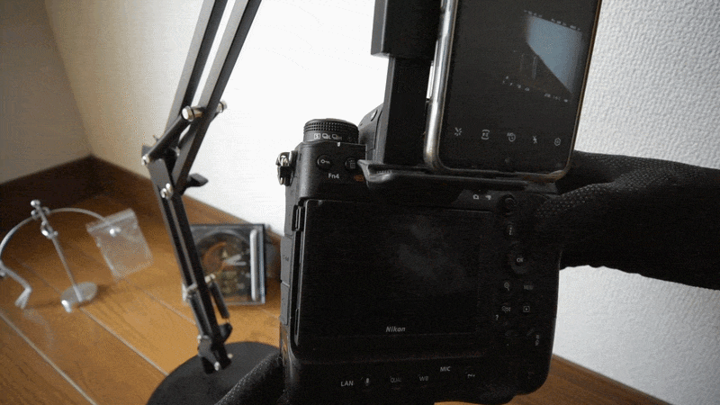

> Published: 2026-05-17 | Last Updated: 2026-06-24

# An Analysis of Display 5 (“Info”) Persistence in Nikon Z-Series Cameras: The Case of the Nikon Z f

Originally initiated as an investigation into unusual “Info” persistence on my personal Nikon Z f, this repository gradually expanded into a broader observational analysis of Display 5 (“Info”) behavior, which is featured on the Nikon Z9, Z8, and Z f among the Z-series.

With this particular camera, pressing the shutter button halfway at times failed to immediately ready the camera for shooting. This behavior can depart from a photographer’s natural expectations and may lead to missed photo opportunities. Furthermore, under default settings, the LCD could remain locked on the Information Display even during continuous shooting. 
Several of these and other Info display behaviors have been confirmed by Nikon Support in Japan.   

To uncover the specific triggering conditions and identify potential workarounds, I conducted detailed behavioral observations.

I hypothesize that the phenomena observed here are closely tied to the “Information Display (Info)”—a feature inherited from the D-series DSLRs—and may represent a visible manifestation of the coexistence between legacy and modern system logic.

Although I am a complete layman in the field of systems engineering, I hold a deep interest in user interfaces and the integration of legacy and modern technology. I share this report in the hope that it will spark meaningful discussions among experts and specialists in the community.

As this analysis was conducted independently by a non-specialist, some terminology or interpretations may be incomplete.

*In this repository, the term “fixation” is used operationally to describe a state in which the camera remains on, or repeatedly returns to, the Info display despite ordinary shooting-recovery operations.*

*The term does not by itself imply a conclusion regarding Nikon’s internal firmware intent. It reflects behavior that appears unnatural from the standpoint of consistency with long-standing Nikon shooting-operation expectations—particularly the expectation that a shutter-button half-press should promptly restore a shooting-ready view—as well as from the behavior of MENU screen transitions.*

*At the same time, this “fixation” does not necessarily always cause practical problems. For example, on models such as the Z f that lack a top-plate LCD, having the Info display appear immediately after power-on can be useful. Therefore, this repository also explores possible ways to coexist effectively with the new role of the Info display.*

---

## Quick Reading Guide

Readers who want the shortest path to the core issue may begin with:

- [Nikon Support Confirmations](./Nikon_Support_Confirmation_Notes/README.md)
- [Insights & Hypotheses](./insights.md)
- [Post-Publication Updates](./post-publication-updates.md)

*For Japanese readers: 「考察および仮説」の日本語版はこちら:* [考察および仮説 (日本語版)](./insights_ja.md)

The detailed observation tables are the primary evidence base for this repository and provide traceability for the conclusions discussed here.

---

## 1. Project Overview

### 1.1 Objective

- Visualization of state transitions involving the "Information Display (Info)" on the Nikon Z f.
- Logical analysis of display priority, state persistence, and the coexistence of legacy and modern architectures within the system under specific operational conditions.
- A comprehensive study based on operational confirmations from Nikon Support regarding the camera's display behavior and transition logic.
- Supplementary observations utilizing a Nikon Z9 procured for testing.

### 1.2 Historical Context

The “Info” display in Nikon cameras historically functioned as a temporary shooting-information screen.

Introduced prominently during the DSLR era (e.g., Nikon D3 generation), the Info display was accessed via a dedicated “INFO” button and Nikon manuals explicitly documented how to dismiss the screen, including:
- half-pressing the shutter button,
- pressing the INFO/R button again,
- or waiting for timeout.

This behavior and terminology remained consistently documented through multiple DSLR generations.

However, with the EXPEED 6 generation and the launch of the Nikon Z system, including the first Z-series cameras and later DSLRs such as the D780 and D6, such dismissal instructions appear to disappear from the manuals.

This does not prove that EXPEED 6 itself caused the behavioral change. 
Nonetheless, the timing suggests that the role of the Info display may have been reconsidered during the transition from DSLR-era temporary Info screens to the Display (“Info”) in EXPEED 6-generation Z-series cameras, which likely led to Display 5 (“Info”) as a persistent display mode in EXPEED 7.

| Era                  | Info access method                     | Manual                                         | Actual behavior        |
| -------------------- | -------------------------------------- | ---------------------------------------------- | ---------------------- |
| D3–D3500             | Dedicated INFO/R button                | “Info can be turned off” explicitly documented | half-press clears Info |
| Z7/Z6(EXPEED 6)      | Integrated into DISP cycle             | documentation removed                          | unknown                |
| D780 (EXPEED 6)      | Dedicated INFO/R button                | documentation removed                          | unknown                |
| D6 (EXPEED 6)        | Dedicated INFO/R button                | documentation removed                          | half-press still works |
| Z9/Z8/Zf (EXPEED 7)  | Integrated into DISP cycle   (Display 5) | documentation removed                     | Display5 persistence   |

This repository does not attempt to infer Nikon’s internal design intentions.
However, the observed transition in documentation and device behavior appears to coincide with the introduction of the Z system and may be historically significant.

### 1.3 Observed Phenomena 

* **Display Priority Persistence:** The "Information Display (Info)" appears to preempt or retain display priority over other operational displays under certain conditions.
* **Recovery Path Removal Through Configuration:** Certain customizations can make standard UI-level recovery paths inaccessible without any explicit system warning.
* **State Persistence:** The status of the "Information Display (Info)" is maintained (resumed) even after cycling the power.
* **Inconsistency of Internal States:** Even when the visual appearance remains identical, the system's response (output) to inputs varies depending on past display history.
* **Persistent Info Display Under Specific Modes:** Under specific conditions such as continuous shooting mode, the "Information Display (Info)" persistently occupies the entire LCD when the user's eye is removed from the viewfinder.

### 1.4 Target Environment

- **Primary Device:** Nikon Z f (Firmware: [ C: Ver. 3.01 ])
- **Supplementary Device:** Nikon Z9 (Firmware: [ C: Ver. 4.00 ]) Procured for testing

### 1.5 Notes on the Observation Process

The cases in this repository were developed chronologically through observation, rather than from a predefined state model.

Over time, these observations revealed inconsistencies, hidden dependencies, and visually identical states exhibiting different operational behaviors. Consequently, state definitions and transition interpretations evolved throughout the investigation process.

For this reason, earlier tables intentionally preserve the original coarse-grained observations, including ambiguities and apparent inconsistencies that later motivated finer-grained analyses.

Ultimately, this repository is not merely a collection of transition tables, but also a chronological observational record documenting how the underlying display-state structure gradually became visible.

---

## 2. Structure of Data 

### Phase 1: Definition A (Coarse-grained)
- [DA README](./docs/DA/README.md)
- [**Case A1:** Schrödinger's Sisyphean Loop](./docs/DA/Case_A1_Schrodinger.md)  
  This case records the initial observations that motivated the repository: shutter-button half-press did not always restore Live View, and visually identical states could produce different outcomes depending on prior display history.

- [**Case A2:** Deterministic Loop: Immediate Transition from Default Settings](./docs/DA/Case_A2_Deterministic.md)  
  This case records how a minimal operation under factory-default settings can transition the camera into persistent Info-display behavior, and how subsequent customization can unintentionally disable simple recovery routes without warning.

### Phase 2: Definition B (Fine-grained)
- [DB README](./docs/DB/README.md)
- [**Case B1:** The Shadow Double](./docs/DB/Case_B1_Shadow.md)  
  This case examines multiple activation pathways into visually similar Info displays, including Display 5 as configured under [d19 Custom monitor shooting display] and non-Display 5 routes. It compares their behavior and identifies pathways that lead to persistent display states.

- [**Case B2:** In the Fray of the Focus](./docs/DB/Case_B2_Fray.md)  
  While earlier cases focus mainly on pre-shooting display states, this case examines behavior during shooting operations. It records observations in which Info-display persistence remains active even during continuous shooting, depending on the display configuration.

- [**Case B3:** Cornering the Shadow: A Trace from the Past](./docs/DB/Case_B3_Cornering.md)  
  This case investigates boundary conditions of the persistent Info behavior, including LCD activation thresholds, overlay routes, Display 5 ON/OFF differences, and cases where prior display history reappears through later recovery behavior.

---

## 3. Nikon Support Confirmation Notes
Operational confirmations on the actual device were obtained from Nikon Support in Japan out of practical necessity.
I am deeply grateful for their kind cooperation.

- [Nikon Support Confirmation Notes README](./Nikon_Support_Confirmation_Notes/README.md)
- [Nikon Support Confirmation Notes](./Nikon_Support_Confirmation_Notes/Nikon_Support_Confirmation_Notes.md)

---

## 4. Insights & Hypotheses
- [Insights & Hypotheses](./insights.md)
- [考察および仮説 (日本語版)](./insights_ja.md)
*A Japanese version of the Insights is also provided, because several aspects of this issue concern Nikon’s historical camera-design culture and may be better expressed in Japanese.*

---

## 5. Post-Publication Updates

The main report reflects the information available at the time of initial publication.

Any later Nikon support responses, additional model-specific confirmations, or follow-up analysis will be recorded separately in:

- [Post-Publication Updates](./post-publication-updates.md)

---

## 6. Visual Appendix

### Zf observation: Case B2
- 
*Note: This video does not completely reproduce the steps for Case B2.*

- 
  
*Note: A short GIF clipped from the reference video showing the key steps for Case B2.*

### Supplementary Z9 Observation

A supplementary check using a particular Nikon Z9 showed the same core Display 5 (“Info”) behavior observed on the Nikon Z f. The Info display could remain visible even during continuous shooting.

- 
- 

### Extra Visualization
- [Extra Visualization (Concept Map)](./case-a1-concept-map-cat.svg)
　- [Download PDF version](https://github.com/acta-lgtm/nikon-z-display5-persistence-case-zf/releases/download/260617/case-a1-concept-map-cat.pdf)

---

## 7. Appendix: Reference Definitions

### Display Control Context Notation

Contexts are written in the following form:

`Context <MonitorMode>(<AutoSwitch>; DP1-4=<enabled displays>; DP5=<ON/OFF>)`

> MonitorMode
 
>- `PV` = Prioritize viewfinder (1 or 2)
>- `AS` = Automatic display switch
>- `MO` = Monitor only

> AutoSwitch

>- `O` = Automatic monitor display switch: On
>- `OD` = Automatic monitor display switch: On (when monitor docked)
>- `-` = Not applicable or not changed in this context

> DP1-4, DP5

>- `DP1-4=1,2,3,4` means Display 1 through Display 4 are enabled in [d19 Custom monitor shooting display].
>- `DP1-4=1` means only Display 1 is enabled.
>- `DP1-4=none` means none of Display 1 through Display 4 is enabled.
>- `DP5=ON/OFF` indicates whether Display 5 (“Info”) is enabled.

Example: `Context PV(OD; DP1-4=1,2,3,4; DP5=ON)`

### Assessment Codes

- **E** = Expected
- **N** = Not Expected
- **M** = Mechanically consistent, but operationally/semantically notable

The assessment labels used in this repository are primarily based on operational expectations historically associated with Nikon DSLR cameras, particularly the long-established behavior in which half-pressing the shutter button immediately restores a shooting-ready state from the Info display.

These assessments therefore reflect practical shooting responsiveness and user-observable operational consistency, rather than assumptions regarding internal firmware implementation.

This repository does not assume that DSLR-era behavior necessarily represents the only correct design philosophy.

However, the currently observed Display 5 persistence behavior — including the inability to reliably exit via half-press in some contexts, as well as the continuous Info display observed during burst shooting operations in Case B2 — also appears open to discussion from the standpoint of shooting responsiveness and display-state consistency.

It is hoped that these observations may contribute to further discussion regarding the operational semantics of Display 5 ("Info") in Nikon Z-series cameras.

Furthermore, although I have found certain points that warrant revision during my verification and analysis, I have deliberately kept them as they are to respect the chronological flow of the observations.

---

## Disclaimer

This repository contains personal observations and hypotheses
based on behavior observed on a specific Nikon Z f unit.

The observations and interpretations presented here do not
represent official Nikon specifications, nor do they imply
that identical behavior occurs on all units.

---

## License

Unless otherwise noted, the contents of this repository
are licensed under the Creative Commons
Attribution-NonCommercial 4.0 International License
(CC BY-NC 4.0).

See [LICENSE](./LICENSE.md) for details.

---

This repository is a work in progress and will be updated as additional observations are organized.
