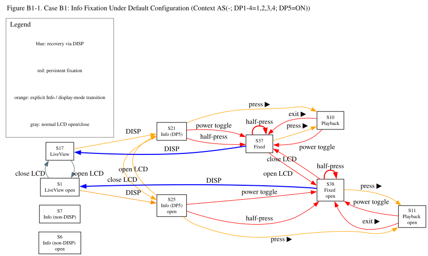
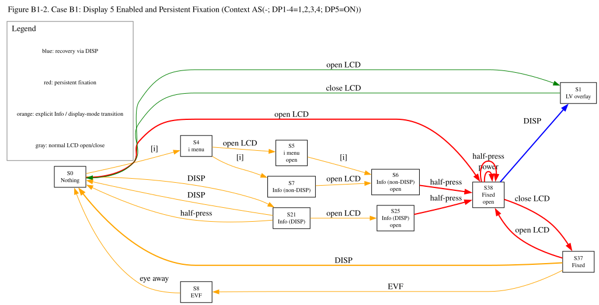
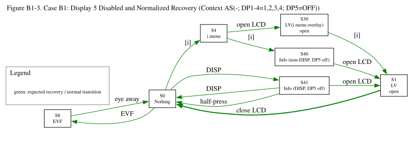

# Case B1: The Shadow Double (Firmware Ver. 3.01)

## Revision History
| Rev. | Date | Description |
| :--- | :--- | :--- |
| 1.0 | 2026-05-07 | Initial report. |
| 1.1 | 2026-05-08 | Refined the state definitions in the state transition table. |
| 1.2 | 2026-05-09 | Added State S35-S36, Steps 185–251, and "Preparation and Settings" Item 9. |
| 1.3 | 2026-05-11 | Added "Preparation and Settings" Item 10. |
| 1.4 | 2026-05-14 | Refined operational assessment criteria (E/N/M) and added display-control context definitions to distinguish user-observable behavior from inferred display-control consistency. |
| 1.5 | 2026-05-21 | Added state definitions S37 and S38, and revised S6, S7, S21, and S25. Concurrently updated the relevant tables. |
| 1.6 | 2026-05-22 | Added state definitions S39 and S42, and revised S6, S7, S21, S37 and S38. Concurrently updated the relevant tables. Added Steps 252–277|
| 1.7 | 2026-05-25 | Added state definitions S43-S46. Concurrently updated the relevant tables.|
| 1.8 | 2026-05-31 | Introduced structured display-control context notation:`Context <MonitorMode>(<AutoSwitch>; DP1-4=<enabled displays>; DP5=<ON/OFF>)`.  The change was made to better describe later observations involving Display 5 persistence, Live View display-index retention, and context-dependent recovery behavior.  Concurrently updated the relevant tables. Added observational Notes|

---

### 1. Core Observation

*   **Phenomenon:**
    - The full-screen Info display can be shown by operating the [DISP] button. However, visually similar Info displays can also appear through other routes, independent of the photographer’s explicit intention to select Display 5.
    - Even when the [DISP] button is used, the number of required button presses and the resulting behavior may differ depending on the LCD monitor state. This suggests that the Info display has multiple activation pathways.
    - Regardless of the pathway, under certain display routes, the LCD may become locked on the Info display. Once this occurs, shutter-button half-press and power cycling may fail to restore Live View.
    - Disabling Info as Display 5, as defined in [CUSTOM SETTINGS MENU] > [d19 Custom monitor shooting display], prevents the display from persisting. However, it was also observed that after passing through the Info screen, the system resets to Display 1.
    
*   **Core Issue:**
    The Info display has multiple activation pathways. Some of these pathways appear to convert the Info display into a persistent display state, making subsequent shutter-button recovery and Live View restoration difficult or unpredictable from the user’s perspective.

### Figure B1-1. Info Fixation Under Default Configuration

Source: [`Case_B1_Figure1.dot`](../../figures/Case_B1_Figure1.dot)

The diagram focuses on Steps 1-126, 222-277.

This figure summarizes the default-configuration observations in which explicitly selected Display 5 Info states (S21/S25) collapse into persistent fixation states (S37/S38) after operations such as half-press, power cycling, or playback exit.

The purpose of this figure is not to show all state transitions, but to highlight how visually similar Info displays diverge operationally depending on route and persistence behavior.

### Figure B1-2. Display 5 Enabled and Persistent Fixation

Source: [`Case_B1_Figure2.dot`](../../figures/Case_B1_Figure2.dot)

The diagram focuses on Steps 156–196, excluding Step 187.

This figure summarizes the Context B observations after Display 5 was re-enabled. Under this condition, both explicit DISP-route Info states and non-DISP Info states could collapse into persistent fixation states. 

### Figure B1-3. Display 5 Disabled and Normalized Recovery

Source: [`Case_B1_Figure3.dot`](../../figures/Case_B1_Figure3.dot)

The diagram focuses on Steps 127–155, 197-207.

This figure summarizes the Context B observations after Display 5 was disabled. Under the same display-routing environment that previously allowed persistent fixation, the Info states observed with Display 5 disabled returned through expected transitions such as DISP, half-press, LCD opening, and [i] menu dismissal.

The result suggests that Display 5 plays a central role in the persistent fixation behavior observed in the corresponding Display 5 enabled sequences.

---

## 2. Preparation and Settings

1. Ensure a memory card with saved images is inserted. (If none exist, capture an image first.)
2. Keep the LCD monitor docked (folded into the body) with the screen facing you.
3. Initialize all camera settings.
4. Attach a native Z-mount lens, an F-mount lens via FTZ, or a non-CPU manual focus lens, and remove the lens cap, as no lens-specific variations were observed in my scope of testing.
5. In **[CUSTOM SETTINGS MENU] > [c3 Power off delay]**, set each item to the maximum duration.
6. Use the Monitor mode button to set it to **Automatic display switch** (default).
7. In [CUSTOM SETTINGS MENU] > [d19 Custom monitor shooting display], ensure that all displays (Display 1 to 5) are checked and Display 1 is selected (default).
8. In **[CUSTOM SETTINGS MENU] > [d19 Custom monitor shooting display]**, configure each display as follows to easily identify which display number is currently active.
    * **Display 2:** Uncheck all items, then check only [Histogram].
    * **Display 3:** Uncheck all items, then check only [Framing grid].
    * **Display 4:** Uncheck all items, then check only [Center indicator].
    * *Finally, ensure that each box for Display 1 through Display 5 itself is checked.*
9. In **[CUSTOM SETTINGS MENU] > [d20 Custom viewfinder shooting display]**, apply the same settings as the monitor for the same identification purpose.
    * **Display 2:** Uncheck all items, then check only [Histogram].
    * **Display 3:** Uncheck all items, then check only [Framing grid].
    * **Display 4:** Uncheck all items, then check only [Center indicator].
    * *Finally, ensure that each box for Display 1 through Display 4 itself is checked.*
10. To avoid interference with the verification process, adjust the shutter speed as necessary so that it remains faster than approximately 1/60 s.
11. Power off.

---

## 3. Experimental Contexts

### Display Control Context Notation

Contexts are written in the following form:

`Context <MonitorMode>(<AutoSwitch>; DP1-4=<enabled displays>; DP5=<ON/OFF>)`

> MonitorMode
 
>- `PV` = Prioritize viewfinder (1 or 2)
>- `AS` = Automatic display switch
>- `MO` = Monitor only

> AutoSwitch

>- `O` = Automatic monitor display switch: On
>- `OD` = Automatic monitor display switch: On (when monitor docked)
>- `-` = Not applicable or not changed in this context

> DP1-4, DP5

>- `DP1-4=1,2,3,4` means Display 1 through Display 4 are enabled in [d19 Custom monitor shooting display].
>- `DP1-4=1` means only Display 1 is enabled.
>- `DP1-4=none` means none of Display 1 through Display 4 is enabled.
>- `DP5=ON/OFF` indicates whether Display 5 (“Info”) is enabled.

Example: `Context PV(OD; DP1-4=1,2,3,4; DP5=ON)`

---

### Assessment Codes

> [!NOTE]
> For details on the evaluation ratings (E / N / M), please refer to the [Assessment Codes](../../README.md#assessment-codes) in the main README.

---

## 4. State Transition Table (Definition B)

> [!NOTE]
> Some states defined in this document are visually indistinguishable
> from one another, yet exhibit different operational behavior
> depending on prior display-routing history and monitor context.

> [!NOTE]
> In the following tables, display overlays are abbreviated as
> “DP1” through “DP5”, corresponding to the selectable display modes
> configured under [d19 Custom monitor shooting display].

> For example:

> - “Live View (with DP1)” indicates Live View with Display 1 overlay.

> [!NOTE]
> For detailed distinctions between visually similar Info states,
> see "Info-State Classification" in the DB README.

### Operational Notes

- Unless otherwise specified, “Open LCD monitor” refers to opening the monitor to at least 20° but less than 140° (to avoid entering self-portrait mode), while keeping the LCD active and allowing viewfinder status checks without triggering the eye sensor.

- Unless otherwise specified, keep your eye and other objects away from the viewfinder to prevent eye sensor activation.

- Unless otherwise specified, perform each operation with an interval of at least three seconds between actions.

- Throughout this table, “closing the LCD” refers to returning the monitor to the docked position with the screen facing the user, as defined in the initial setup.

- WB = White balance.

- with [i] menu  = with [i] menu overlay  

| Step | Current State | Operation                                                     | Next State | LCD Status                                  | EVF Status | My Assessment | Your Assessment             |
| :--- | :------------ | :------------------------------------------------------------ | :--------- | :------------------------------------------ | :------------------ | :----- | :-------- |
| ▼ |  **Context** | **AS (O; DP1-4=1,2,3,4; DP5=ON)**                                    |            |                                                                                               |                   |                                              |                   |
| 1    | S0             | Power on                                                                     | S17         | Live View (with DP1)                          | Off                                        |   E   | E / N / M |
| 2    | S17            | Press the DISP button                                                        | S18         | Live View (with DP2)                          | Off                                        |   E   | E / N / M |
| 3    | S18            | Press the DISP button                                                        | S19         | Live View (with DP3)                          | Off                                        |   E   | E / N / M |
| 4    | S19            | Press the DISP button                                                        | S20         | Live View (with DP4)                          | Off                                        |   E   | E / N / M |
| 5    | S20            | Press the DISP button                                                        | S21         | Info display (explicit DP5 route; DP5 ON)     | Off                                        |   E   | E / N / M |
| 6    | S21            | Press the DISP button                                                        | S17         | Live View (with DP1)                          | Off                                        |   E   | E / N / M |
| 7    | S17            | Open LCD monitor                                                             | S1          | Live View (with DP1)                          | Off                                        |   E   | E / N / M |
| 8    | S1             | Press the DISP button                                                        | S22         | Live View (with DP2)                          | Off                                        |   E   | E / N / M |
| 9    | S22            | Press the DISP button                                                        | S23         | Live View (with DP3)                          | Off                                        |   E   | E / N / M |
| 10   | S23            | Press the DISP button                                                        | S24         | Live View (with DP4)                          | Off                                        |   E   | E / N / M |
| 11   | S24            | Press the DISP button                                                        | S25         | Info display (explicit DP5 route; DP5 ON)     | Off                                        |   E   | E / N / M |
| 12   | S25            | Press the DISP button                                                        | S1          | Live View (with DP1)                          | Off                                        |   E   | E / N / M |
| 13   | S1             | Close LCD monitor                                                            | S17         | Live View (with DP1)                          | Off                                        |   E   | E / N / M |
| 14   | S17            | Look into the EVF                                                            | S8          | Nothing display                               | Live View (with DP1)                       |   E   | E / N / M |
| 15   | S8             | Press the DISP button                                                        | S26         | Nothing display                               | Live View (with DP2)                       |   E   | E / N / M |
| 16   | S26            | Press the DISP button                                                        | S27         | Nothing display                               | Live View (with DP3)                       |   E   | E / N / M |
| 17   | S27            | Press the DISP button                                                        | S28         | Nothing display                               | Live View (with DP4)                       |   E   | E / N / M |
| 18   | S28            | Press the DISP button                                                        | S8          | Nothing display                               | Live View (with DP1)                       |   E   | E / N / M |
| 19   | S8             | Move eye away from EVF                                                       | S17         | Live View (with DP1)                          | Off                                        |   E   | E / N / M |
| 20   | S17            | Power off, then on                                                           | S17         | Live View (with DP1)                          | Off                                        |   E   | E / N / M |
| 21   | S17            | Press the DISP button                                                        | S18         | Live View (with DP2)                          | Off                                        |   E   | E / N / M |
| 22   | S18            | Power off -> battery removal -> wait 10 min -> reinstall -> Power on         | S18         | Live View (with DP2)                          | Off                                        |   E   | E / N / M |
| 23   | S18            | Press DISP button repeatedly until Display 5=Info is shown                   | S21         | Info display (explicit DP5 route; DP5 ON)     | Off                                        |   E   | E / N / M |
| 24   | S21            | Power off -> battery removal -> wait 10 min -> reinstall -> Power on         | S37         | Info display (persistent fixation)            | Off                                        | **N** | E / N / M |
| 25   | S37            | Half-press shutter button                                                    | S37         | Info display (persistent fixation)            | Off                                        | **N** | E / N / M |
| 26   | S37            | Open LCD monitor                                                             | S38         | Info display (persistent fixation)            | Off                                        | **M** | E / N / M |
| 27   | S38            | Half-press shutter button                                                    | S38         | Info display (persistent fixation)            | Off                                        | **N** | E / N / M |
| 28   | S38            | Close LCD monitor                                                            | S37         | Info display (persistent fixation)            | Off                                        | **M** | E / N / M |
| 29   | S37            | Press the DISP button                                                        | S17         | Live View (with DP1)                          | Off                                        |   E   | E / N / M |
| 30   | S17            | Power off, then on                                                           | S17         | Live View (with DP1)                          | Off                                        |   E   | E / N / M |
| 31   | S17            | Press and hold the Fn button                                                 | S32         | Live View with the WB adjustment overlay      | Off                                        |   E   | E / N / M |
| 32   | S32            | Release the Fn button                                                        | S17         | Live View (with DP1)                          | Off                                        |   E   | E / N / M |
| 33   | S17            | Open LCD monitor                                                             | S1          | Live View (with DP1)                          | Off                                        |   E   | E / N / M |
| 34   | S1             | Press and hold the Fn button                                                 | S15         | Live View with the WB adjustment overlay      | Off                                        |   E   | E / N / M |
| 35   | S15            | Release the Fn button                                                        | S1          | Live View (with DP1)                          | Off                                        |   E   | E / N / M |
| 36   | S1             | Close LCD monitor                                                            | S17         | Live View (with DP1)                          | Off                                        |   E   | E / N / M |
| 37   | S17            | Look into the EVF                                                            | S8          | Nothing display                               | Live View (with DP1)                       |   E   | E / N / M |
| 38   | S8             | Press and hold the Fn button                                                 | S16         | Nothing display                               | Live View with the WB adjustment overlay   |   E   | E / N / M |
| 39   | S16            | Release the Fn button                                                        | S8          | Nothing display                               | Live View (with DP1)                       |   E   | E / N / M |
| 40   | S8             | Move eye away from EVF                                                       | S17         | Nothing display                               | Live View (with DP1)                       |   E   | E / N / M |
| 41   | S17            | Press the DISP button                                                        | S18         | Live View (with DP2)                          | Off                                        |   E   | E / N / M |
| 42   | S18            | Press and hold the Fn button                                                 | S32         | Live View with the WB adjustment overlay      | Off                                        |   E   | E / N / M |
| 43   | S32            | Release the Fn button                                                        | S18         | Live View (with DP2)                          | Off                                        |   E   | E / N / M |
| 44   | S18            | Open LCD monitor                                                             | S22         | Live View (with DP2)                          | Off                                        |   E   | E / N / M |
| 45   | S22            | Press and hold the Fn button                                                 | S15         | Live View with the WB adjustment overlay      | Off                                        |   E   | E / N / M |
| 46   | S15            | Release the Fn button                                                        | S22         | Live View (with DP2)                          | Off                                        |   E   | E / N / M |
| 47   | S22            | Close LCD monitor                                                            | S18         | Live View (with DP2)                          | Off                                        |   E   | E / N / M |
| 48   | S18            | Look into the EVF                                                            | S8          | Nothing display                               | Live View (with DP1)                       |   E   | E / N / M |
| 49   | S8             | Press and hold the Fn button                                                 | S16         | Nothing display                               | Live View with the WB adjustment overlay   |   E   | E / N / M |
| 50   | S16            | Release the Fn button                                                        | S8          | Nothing display                               | Live View (with DP1)                       |   E   | E / N / M |
| 51   | S8             | Move eye away from EVF                                                       | S18         | Live View (with DP2)                          | Off                                        |   E   | E / N / M |
| 52   | S18            | Press DISP button repeatedly until Display 5=Info is shown                   | S21         | Info display (explicit DP5 route; DP5 ON)     | Off                                        |   E   | E / N / M |
| 53   | S21            | Press and hold the Fn button                                                 | S12         | Only the WB adjustment overlay                | Off                                        |   E   | E / N / M |
| 54   | S12            | Release the Fn button                                                        | S21         | Info display (explicit DP5 route; DP5 ON)     | Off                                        |   E   | E / N / M |
| 55   | S21            | Open LCD monitor                                                             | S25         | Info display (explicit DP5 route; DP5 ON)     | Off                                        |   E   | E / N / M |
| 56   | S25            | Press and hold the Fn button                                                 | S13         | Only the WB adjustment overlay                | Off                                        |   E   | E / N / M |
| 57   | S13            | Release the Fn button                                                        | S25         | Info display (explicit DP5 route; DP5 ON)     | Off                                        |   E   | E / N / M |
| 58   | S25            | Close LCD monitor                                                            | S21         | Info display (explicit DP5 route; DP5 ON)     | Off                                        |   E   | E / N / M |
| 59   | S21            | Look into the EVF                                                            | S8          | Nothing display                               | Live View (with DP1)                       |   E   | E / N / M |
| 60   | S8             | Press and hold the Fn button                                                 | S16         | Nothing display                               | Live View with the WB adjustment overlay   |   E   | E / N / M |
| 61   | S16            | Release the Fn button                                                        | S8          | Nothing display                               | Live View (with DP1)                       |   E   | E / N / M |
| 62   | S8             | Move eye away from EVF                                                       | S21         | Info display (explicit DP5 route; DP5 ON)     | Off                                        |   E   | E / N / M |
| 63   | S21            | Press DISP button repeatedly until Display 2 is shown                        | S18         | Live View (with DP2)                          | Off                                        |   E   | E / N / M |
| 64   | S18            | Press [i] button                                                             | S29         | Live View with [i] menu                       | Off                                        |   E   | E / N / M |
| 65   | S29            | Press [i] button                                                             | S18         | Live View (with DP2)                          | Off                                        |   E   | E / N / M |
| 66   | S18            | Open LCD monitor                                                             | S22         | Live View (with DP2)                          | Off                                        |   E   | E / N / M |
| 67   | S22            | Press [i] button                                                             | S30         | Live View with [i] menu                       | Off                                        |   E   | E / N / M |
| 68   | S30            | Press [i] button                                                             | S22         | Live View (with DP2)                          | Off                                        |   E   | E / N / M |
| 69   | S22            | Close LCD monitor                                                            | S18         | Live View (with DP2)                          | Off                                        |   E   | E / N / M |
| 70   | S18            | Look into the EVF                                                            | S8          | Nothing display                               | Live View (with DP1)                       |   E   | E / N / M |
| 71   | S8             | Press [i] button                                                             | S31         | Nothing display                               | Live View with [i] menu                    |   E   | E / N / M |
| 72   | S31            | Press [i] button                                                             | S8          | Nothing display                               | Live View (with DP1)                       |   E   | E / N / M |
| 73   | S8             | Move eye away from EVF                                                       | S18         | Live View (with DP2)                          | Off                                        |   E   | E / N / M |
| 74   | S18            | Press DISP button repeatedly until Display 5 is shown                        | S21         | Info display (explicit DP5 route; DP5 ON)     | Off                                        |   E   | E / N / M |
| 75   | S21            | Press [i] button                                                             | S33         | Info display (explicit DP5 route; DP5 ON)   with [i] menu | Off                         |   E   | E / N / M |
| 76   | S33            | Press [i] button                                                             | S21         | Info display (explicit DP5 route; DP5 ON)     | Off                                        |   E   | E / N / M |
| 77   | S21            | Open LCD monitor                                                             | S25         | Info display (explicit DP5 route; DP5 ON)     | Off                                        |   E   | E / N / M |
| 78   | S25            | Press [i] button                                                             | S34         | Info display (explicit DP5 route; DP5 ON)    with [i] menu | Off                        |   E   | E / N / M |
| 79   | S34            | Press [i] button                                                             | S25         | Info display (explicit DP5 route; DP5 ON)     | Off                                        |   E   | E / N / M |
| 80   | S25            | Close LCD monitor                                                            | S21         | Info display (explicit DP5 route; DP5 ON)     | Off                                        |   E   | E / N / M |
| 81   | S21            | Look into the EVF                                                            | S8          | Nothing display                               | Live View (with DP1)                       |   E   | E / N / M |
| 82   | S8             | Press [i] button                                                             | S31         | Nothing display                               | Live View with [i] menu                    |   E   | E / N / M |
| 83   | S31            | Press [i] button                                                             | S8          | Nothing display                               | Live View (with DP1)                       |   E   | E / N / M |
| 84   | S8             | Move eye away from EVF                                                       | S21         | Info display (explicit DP5 route; DP5 ON)     | Off                                        |   E   | E / N / M |
| 85   | S21            | Look into the EVF                                                            | S8          | Nothing display                               | Live View (with DP1)                       |   E   | E / N / M |
| 86   | S8             | Press the DISP button                                                        | S26         | Nothing display                               | Live View (with DP2)                       |   E   | E / N / M |
| 87   | S26            | Move eye away from EVF                                                       | S21         | Info display (explicit DP5 route; DP5 ON)     | Off                                        |   E   | E / N / M |
| 88   | S21            | Look into the EVF                                                            | S26         | Nothing display                               | Live View (with DP2)                       |   E   | E / N / M |
| 89   | S26            | Press the DISP button                                                        | S27         | Nothing display                               | Live View (with DP3)                       |   E   | E / N / M |
| 90   | S27            | Move eye away from EVF                                                       | S21         | Info display (explicit DP5 route; DP5 ON)     | Off                                        |   E   | E / N / M |
| 91   | S21            | Look into the EVF                                                            | S27         | Nothing display                               | Live View (with DP3)                       |   E   | E / N / M |
| 92   | S27            | Press the DISP button                                                        | S28         | Nothing display                               | Live View (with DP4)                       |   E   | E / N / M |
| 93   | S28            | Move eye away from EVF                                                       | S21         | Info display (explicit DP5 route; DP5 ON)     | Off                                        |   E   | E / N / M |
| 94   | S21            | Look into the EVF                                                            | S28         | Nothing display                               | Live View (with DP4)                       |   E   | E / N / M |
| 95   | S28            | Press the DISP button                                                        | S8          | Nothing display                               | Live View (with DP1)                       |   E   | E / N / M |
| 96   | S8             | Move eye away from EVF                                                       | S21         | Info display (explicit DP5 route; DP5 ON)     | Off                                        |   E   | E / N / M |
| 97   | S21            | Press the DISP button                                                        | S17         | Live View (with DP1)                          | Off                                        |   E   | E / N / M |
| 98   | S17            | Power off, then on                                                           | S17         | Live View (with DP1)                          | Off                                        |   E   | E / N / M |
| ▼ |  **Context** | **AS (O; DP1-4=1,2,3,4; DP5=OFF)**                                   |            |                                                                                               |                   |                                              
| 99   | S17            | In [CUSTOM SETTINGS MENU] > [d19 Custom monitor shooting display],  un-check Display 5,  then exit | S17 | Live View (with DP1) | Off |   E   | E / N / M |
| 100  | S17            | Press and hold the Fn button                                                 | S32         | Live View with the WB adjustment overlay      | Off                                        |   E   | E / N / M |
| 101  | S32            | Release the Fn button                                                        | S17         | Live View (with DP1)                          | Off                                        |   E   | E / N / M |
| 102  | S17            | Open LCD monitor                                                             | S1          | Live View (with DP1)                          | Off                                        |   E   | E / N / M |
| 103  | S1             | Press and hold the Fn button                                                 | S15         | Live View with the WB adjustment overlay      | Off                                        |   E   | E / N / M |
| 104  | S15            | Release the Fn button                                                        | S1          | Live View (with DP1)                          | Off                                        |   E   | E / N / M |
| 105  | S1             | Close LCD monitor                                                            | S17         | Live View (with DP1)                          | Off                                        |   E   | E / N / M |
| 106  | S17            | Press [i] button                                                             | S29         | Live View with [i] menu                       | Off                                        |   E   | E / N / M |
| 107  | S29            | Press [i] button                                                             | S17         | Live View (with DP1)                          | Off                                        |   E   | E / N / M |
| 108  | S17            | Open LCD monitor                                                             | S1          | Live View (with DP1)                          | Off                                        |   E   | E / N / M |
| 109  | S1             | Press [i] button                                                             | S30         | Live View with [i] menu                       | Off                                        |   E   | E / N / M |
| 110  | S30            | Press [i] button                                                             | S1          | Live View (with DP1)                          | Off                                        |   E   | E / N / M |
| 111  | S1             | Close LCD monitor                                                            | S17         | Live View (with DP1)                          | Off                                        |   E   | E / N / M |
| 112  | S17            | Power off, then on                                                           | S17         | Live View (with DP1)                          | Off                                        |   E   | E / N / M |
| ▼ |  **Context** | **AS (OD; DP1-4=1,2,3,4; DP5=OFF)**                                   |            |                                                                                               |                   |                                              
| 113  | S17            | In [SETUP MENU] > [Automatic monitor display switch],  set it to "On (when monitor docked)", then exit | S17 | Live View (with DP1) | Off |   E   | E / N / M |
| 114  | S17            | Press and hold the Fn button                                                 | S32         | Live View with the WB adjustment overlay      | Off                                        |   E   | E / N / M |
| 115  | S32            | Release the Fn button                                                        | S17         | Live View (with DP1)                          | Off                                        |   E   | E / N / M |
| 116  | S17            | Open LCD monitor                                                             | S1          | Live View (with DP1)                          | Off                                        |   E   | E / N / M |
| 117  | S1             | Press and hold the Fn button                                                 | S15         | Live View with the WB adjustment overlay      | Off                                        |   E   | E / N / M |
| 118  | S15            | Release the Fn button                                                        | S1          | Live View (with DP1)                          | Off                                        |   E   | E / N / M |
| 119  | S1             | Close LCD monitor                                                            | S17         | Live View (with DP1)                          | Off                                        |   E   | E / N / M |
| 120  | S17            | Press [i] button                                                             | S29         | Live View with [i] menu                       | Off                                        |   E   | E / N / M |
| 121  | S29            | Press [i] button                                                             | S17         | Live View (with DP1)                          | Off                                        |   E   | E / N / M |
| 122  | S17            | Open LCD monitor                                                             | S1          | Live View (with DP1)                          | Off                                        |   E   | E / N / M |
| 123  | S1             | Press [i] button                                                             | S30         | Live View with [i] menu                       | Off                                        |   E   | E / N / M |
| 124  | S30            | Press [i] button                                                             | S1          | Live View (with DP1)                          | Off                                        |   E   | E / N / M |
| 125  | S1             | Close LCD monitor                                                            | S17         | Live View (with DP1)                          | Off                                        |   E   | E / N / M |
| 126  | S17            | Power off, then on                                                           | S17         | Live View (with DP1)                          | Off                                        |   E   | E / N / M |
| ▼ |  **Context** | **PV (OD; DP1-4=1,2,3,4; DP5=OFF)**                                   |            |                                                                                               |                   |                                              
| 127  | S17            | In [SETUP MENU] > [Limit monitor mode selection],  select ONLY "Prioritize viewfinder  (1 or 2)", then exit | S0 | Nothing display | Off |   E   | E / N / M |
| 128  | S0             | Power off, then on                                                           | S0          | Nothing display                               | Off                                        |   E   | E / N / M |
| 129  | S0             | Press the DISP button                                                        | S40         | Info display (non-DISP route; DP5 OFF)        | Off                                        |   E   | E / N / M |
| 130  | S40            | Press the DISP button                                                        | S0          | Nothing display                               | Off                                        |   E   | E / N / M |
| 131  | S0             | Press the DISP button                                                        | S40         | Info display (non-DISP route; DP5 OFF)        | Off                                        |   E   | E / N / M |
| 132  | S40            | Half-press shutter button                                                    | S0          | Nothing display                               | Off                                        |   E   | E / N / M |
| 133  | S0             | Press the DISP button                                                        | S40         | Info display (non-DISP route; DP5 OFF)        | Off                                        |   E   | E / N / M |
| 134  | S40            | Power off, then on                                                           | S0          | Nothing display                               | Off                                        |   E   | E / N / M |
| 135  | S0             | Press the DISP button                                                        | S40         | Info display (non-DISP route; DP5 OFF)        | Off                                        |   E   | E / N / M |
| 136  | S40            | Open LCD monitor                                                             | S1          | Live View (with DP1)                           | Off                                        |   E   | E / N / M |
| 137  | S1             | Press the DISP button                                                        | S22         | Live View (with DP2)                          | Off                                        |   E   | E / N / M |
| 138  | S22            | Close LCD monitor                                                            | S0          | Nothing display                               | Off                                        |   E   | E / N / M |
| 139  | S0             | Power off, then on                                                           | S0          | Nothing display                               | Off                                        |   E   | E / N / M |
| 140  | S0             | Press and hold the Fn button                                                 | S12         | Only the WB adjustment overlay                | Off                                        |   E   | E / N / M |
| 141  | S12            | Release the Fn button                                                        | S40         | Info display (non-DP5 route; DP5 OFF)         | Off                                        |   E   | E / N / M |
| 142  | S40             | Press the DISP button                                                       | S0          | Nothing display                               | Off                                        |   E   | E / N / M |
| 143  | S0             | Power off, then on                                                           | S0          | Nothing display                               | Off                                        |   E   | E / N / M |
| 144  | S0             | Press and hold the Fn button                                                 | S12         | Only the WB adjustment overlay                | Off                                        |   E   | E / N / M |
| 145  | S12            | Release the Fn button                                                        | S40         | Info display (non-DP5 route; DP5 OFF)         | Off                                        |   E   | E / N / M |
| 146  | S40             | Half-press shutter button                                                   | S0          | Nothing display                               | Off                                        |   E   | E / N / M |
| 147  | S0             | Power off, then on                                                           | S0          | Nothing display                               | Off                                        |   E   | E / N / M |
| 148  | S0             | Press and hold the Fn button                                                 | S12         | Only the WB adjustment overlay                | Off                                        |   E   | E / N / M |
| 149  | S12            | Release the Fn button                                                        | S40         | Info display (non-DP5 route; DP5 OFF)         | Off                                        |   E   | E / N / M |
| 150  | S7             | Power off, then on                                                           | S0          | Nothing display                               | Off                                        |   E   | E / N / M |
| 151  | S0             | Press and hold the Fn button                                                 | S12         | Only the WB adjustment overlay                | Off                                        |   E   | E / N / M |
| 152  | S12            | Release the Fn button                                                        | S40         | Info display (non-DP5 route; DP5 OFF)         | Off                                        |   E   | E / N / M |
| 153  | S40            | Open LCD monitor                                                             | S1          | Live View (with DP1)                          | Off                                        | **M** | E / N / M |
| 154  | S1             | Close LCD monitor                                                            | S0          | Nothing display                               | Off                                        |   E   | E / N / M |
| 155  | S0             | Power off, then on                                                           | S0          | Nothing display                               | Off                                        |   E   | E / N / M |
| ▼ |  **Context** | **PV (OD; DP1-4=1,2,3,4; DP5=ON)**                                   |            |                                                                                               |                   |                                              
| 156  | S0             | In [CUSTOM SETTINGS MENU] > [d19 Custom monitor shooting display],   check Display 5,then exit | S0 | Nothing display | Off |   E   | E / N / M |
| 157  | S0             | Power off, then on                                                           | S0          | Nothing display                               | Off                                        |   E   | E / N / M |
| 158  | S0             | Press the DISP button                                                        | S7          | Info display (non-DP5 route; DP5 ON)          | Off                                        |   E   | E / N / M |
| 159  | S7             | Press the DISP button                                                        | S0          | Nothing display                               | Off                                        |   E   | E / N / M |
| 160  | S0             | Press the DISP button                                                        | S7          | Info display (non-DP5 route; DP5 ON)          | Off                                        |   E   | E / N / M |
| 161  | S7             | Half-press shutter button                                                    | S0          | Nothing display                               | Off                                        |   E   | E / N / M |
| 162  | S0             | Press the DISP button                                                        | S7          | Info display (non-DP5 route; DP5 ON)          | Off                                        |   E   | E / N / M |
| 163  | S7             | Power off, then on                                                           | S0          | Nothing display                               | Off                                        |   E   | E / N / M |
| 164  | S0             | Press the DISP button                                                        | S7          | Info display (non-DP5 route; DP5 ON)          | Off                                        |   E   | E / N / M |
| 165  | S7             | Open LCD monitor                                                             | S6          | Info display (non-DP5 route; DP5 ON)          | Off                                        |   E   | E / N / M |
| 166  | S6             | Half-press shutter button                                                    | S38         | Info display (persistent fixation)            | Off                                        | **N** | E / N / M |
| 167  | S38            | Power off, then on                                                           | S38         | Info display (persistent fixation)            | Off                                        | **N** | E / N / M |
| 168  | S38            | Close LCD monitor                                                            | S37         | Info display (persistent fixation)            | Off                                        | **M** | E / N / M |
| 169  | S37            | Look into the EVF                                                            | S8          | Nothing display                               | Live View (with DP1)                       |   E   | E / N / M |
| 170  | S8             | Move eye away from EVF                                                       | S0          | Nothing display                               | Off                                        |   E   | E / N / M |
| 171  | S0             | Power off, then on                                                           | S0          | Nothing display                               | Off                                        |   E   | E / N / M |
| 172  | S0             | Open LCD monitor                                                             | S38         | Info display (persistent fixation)            | Off                                        | **N** | E / N / M |
| 173  | S38            | Close LCD monitor                                                            | S37         | Info display (persistent fixation)            | Off                                        | **N** | E / N / M |
| 174  | S37            | Press the DISP button                                                        | S0          | Nothing display                               | Off                                        |   E   | E / N / M |
| 175  | S0             | Power off, then on                                                           | S0          | Nothing display                               | Off                                        |   E   | E / N / M |
| 176  | S0             | Open LCD monitor                                                             | S38         | Info display (persistent fixation)            | Off                                        | **N** | E / N / M |
| 177  | S38            | Press the DISP button                                                        | S1          | Live View (with DP1)                          | Off                                        |   E   | E / N / M |
| 178  | S1             | Close LCD monitor                                                            | S0          | Nothing display                               | Off                                        |   E   | E / N / M |
| 179  | S0             | Power off, then on                                                           | S0          | Nothing display                               | Off                                        |   E   | E / N / M |
| 180  | S0             | Press [i] button                                                             | S4          | Info display (non-DP5 route; DP5 ON)   y with [i] menu            | Off                                        |   E   | E / N / M |
| 181  | S4             | Press [i] button                                                             | S7          | Info display (non-DP5 route; DP5 ON)          | Off                                        |   E   | E / N / M |
| 182  | S7             | Open LCD monitor                                                             | S6          | Info display (non-DP5 route; DP5 ON)          | Off                                        |   E   | E / N / M |
| 183  | S6             | Half-press shutter button                                                    | S38         | Info display (persistent fixation)            | Off                                        | **N** | E / N / M |
| 184  | S38            | Power off, then on                                                           | s38         | Info display (persistent fixation)            | Off                                        | **N** | E / N / M |
| 185  | S38            | In [CUSTOM SETTINGS MENU] > [d19 Custom monitor shooting display],  un-check Display 5,  wait 30 s,   re-check Display 5; Half-press shutter button | S38 |  Info display (persistent fixation) | Off |   E   | E / N / M |
| ▼ |  **Context** | **PV (OD; DP1-4=1,2,3,4; DP5=OFF)**                                   |            |                                                                                               |                   |                                              
| 186  | S38            | In [CUSTOM SETTINGS MENU] > [d19 Custom monitor shooting display],  un-check Display 5; Half-press shutter button | S1 | Live View (with DP1)                          | Off |   E   | E / N / M |
| 187  | S1             | Power off, then on                                                           | S1          | Live View (with DP1)                          | Off |   E   | E / N / M |
| ▼ |  **Context** | **PV (OD; DP1-4=1,2,3,4; DP5=ON)**                                   |            |                                                                                               |                   |                                              
| 188  | S1             | In [CUSTOM SETTINGS MENU] > [d19 Custom monitor shooting display],  select Display 5; Half-press shutter button  | S1 | Live View (with DP1)                          | Off |   E   | E / N / M |
| 189  | S1             | Close LCD monitor                                                            | S0          | Nothing display                               | Off                                        |   E   | E / N / M |
| 190  | S0             | Open LCD monitor                                                             | S1          | Live View (with DP1)                          | Off                                        |   E   | E / N / M |
| 191  | S1             | Close LCD monitor                                                            | S0          | Nothing display                               | Off                                        |   E   | E / N / M |
| 192  | S0             | Press [i] button                                                             | S4          | Info display (non-DP5 route; DP5 ON)   with [i] menu            | Off                                        |   E   | E / N / M |
| 193  | S4             | Press [i] button                                                             | S7          | Info display (non-DP5 route; DP5 ON)          | Off                                        |   E   | E / N / M |
| 194  | S7             | Open LCD monitor                                                             | S6          | Info display (non-DP5 route; DP5 ON)          | Off                                        |   E   | E / N / M |
| 195  | S6             | Half-press shutter button                                                    | S38         | Info display (persistent fixation)            | Off                                        | **N** | E / N / M |
| 196  | S38            | Close LCD monitor                                                            | S37         | Info display (persistent fixation)            | Off                                        | **N** | E / N / M |
| ▼ |  **Context** | **PV (OD; DP1-4=1,2,3,4; DP5=OFF)**                                   |            |                                                                                               |                   |                                              
| 197  | S37            | In [CUSTOM SETTINGS MENU] > [d19 Custom monitor shooting display],  un-check Display 5;  Half-press shutter button | S0 | Nothing display                 | Off                                        |   E   | E / N / M |
| 198  | S0             | Open LCD monitor                                                             | S1          | Live View (with DP1)                          | Off                                        |   E   | E / N / M |
| 199  | S1             | Close LCD monitor                                                            | S0          | Nothing display                               | Off                                        |   E   | E / N / M |
| 200  | S0             | Press the DISP button                                                        | S40         | Info display (non-DP5 route; DP5 OFF)         | Off                                        |   E   | E / N / M |
| 201  | S40            | Press the DISP button                                                        | S0          | Nothing display                               | Off                                        |   E   | E / N / M |
| 202  | S0             | Open LCD monitor                                                             | S1          | Live View (with DP1)                          | Off                                        |   E   | E / N / M |
| 203  | S1             | Press the DISP button                                                        | S22         | Live View (with DP2)                          | Off                                        |   E   | E / N / M |
| 204  | S22            | Press the DISP button                                                        | S23         | Live View (with DP3)                          | Off                                        |   E   | E / N / M |
| 205  | S23            | Press the DISP button                                                        | S24         | Live View (with DP4)                          | Off                                        |   E   | E / N / M |
| 206  | S24            | Press the DISP button                                                        | S1          | Live View (with DP1)                          | Off                                        |   E   | E / N / M |
| 207  | S1             | Close LCD monitor                                                            | S0          | Nothing display                               | Off                                        |   E   | E / N / M |
| ▼ |  **Context** | **PV (OD; DP1-4=1,2,3,4; DP5=ON)**                                   |            |                                                                                               |                   |                                              
| 208  | S0             | In [CUSTOM SETTINGS MENU] > [d19 Custom monitor shooting display],  check Display 5, then exit | S0 | Nothing display                  | Off                                        |   E   | E / N / M |
| 209  | S0             | Press the DISP button                                                        | S21         | Info display (explicit DP5 route; DP5 ON)     | Off                                        |   E   | E / N / M |
| 210  | S21            | Press the DISP button                                                        | S0          | Nothing display                               | Off                                        |   E   | E / N / M |
| 211  | S0             | Open LCD monitor                                                             | S1          | Live View (with DP1)                          | Off                                        |   E   | E / N / M |
| 212  | S1             | Close LCD monitor                                                            | S0          | Nothing display                               | Off                                        |   E   | E / N / M |
| 213  | S0             | Open LCD monitor                                                             | S1          | Live View (with DP1)                          | Off                                        |   E   | E / N / M |
| 214  | S1             | Press the DISP button                                                        | S22         | Live View (with DP2)                          | Off                                        |   E   | E / N / M |
| 215  | S22            | Press the DISP button                                                        | S23         | Live View (with DP3)                          | Off                                        |   E   | E / N / M |
| 216  | S23            | Press the DISP button                                                        | S24         | Live View (with DP4)                          | Off                                        |   E   | E / N / M |
| 217  | S24            | Press the DISP button                                                        | S25         | Info display (explicit DP5 route; DP5 ON)     | Off                                        |   E   | E / N / M |
| 218  | S25            | Close LCD monitor                                                            | S21         | Info display (explicit DP5 route; DP5 ON)     | Off                                        |   E    | E / N / M |
| 219  | S21            | Half-press shutter button                                                    | S0          | Nothing display                               | Off                                        |   E   | E / N / M |
| 220  | S0             | Open LCD monitor                                                             | S38         | Info display (persistent fixation)            | Off                                        | **N** | E / N / M |
| 221  | S38            | Close LCD monitor                                                            | S37         | Info display (persistent fixation)            | Off                                        | **M** | E / N / M |
| 222  | S37            | Open LCD monitor                                                             | S38         | Info display (persistent fixation)            | Off                                        | **M** | E / N / M |
| 223  | S38            | Press the DISP button                                                        | S1          | Live View (with DP1)                          | Off                                        |   E   | E / N / M |
| 224  | S1             | Close LCD monitor                                                            | S0          | Nothing display                               | Off                                        |   E   | E / N / M |
| 225  | S0             | Power off, then on                                                           | S0          | Nothing display                               | Off                                        |   E   | E / N / M |
| ▼ |  **Context** | **AS (O; DP1-4=1,2,3,4; DP5=ON)**                                    |            |                                                                                               |                   |                                              
| 226  | S0             | Use the Monitor mode button to set it to "Automatic display switch"          | S17         | Live View (with DP1)                          | Off                                        |   E   | E / N / M |
| 227  | S17            | In [SETUP MENU] > [Automatic monitor display switch],  set it to "On",then exit | S17       | Live View (with DP1)                          | Off                                        |   E   | E / N / M |
| 228  | S17            | Press DISP button repeatedly until Display 5=Info is shown                   | S21         | Info display (explicit DP5 route; DP5 ON)     | Off                                        |   E   | E / N / M |
| 229  | S21            | Open LCD monitor                                                             | S25         | Info display (explicit DP5 route; DP5 ON)     | Off                                        |   E   | E / N / M |
| 230  | S25            | Half-press shutter button                                                    | S38         | Info display (persistent fixation)            | Off                                        | **N** | E / N / M |
| 231  | S38            | Close LCD monitor                                                            | S37         | Info display (persistent fixation)            | Off                                        | **M** | E / N / M |
| 232  | S37            | Press the DISP button                                                        | S17         | Live View (with DP1)                          | Off                                        |   E   | E / N / M |
| 233  | S17            | Power off, then on                                                           | S17         | Live View (with DP1)                          | Off                                        |   E   | E / N / M |
| 234  | S17            | Press DISP button repeatedly until Display 5=Info is shown                   | S21         | Info display (explicit DP5 route; DP5 ON)     | Off                                        |   E   | E / N / M |
| 235  | S21            | Half-press shutter button                                                    | S37         | Info display (persistent fixation)            | Off                                        | **N** | E / N / M |
| 236  | S37            | Open LCD monitor                                                             | S38         | Info display (persistent fixation)            | Off                                        | **M** | E / N / M |
| 237  | S38            | Close LCD monitor                                                            | S37         | Info display (persistent fixation)            | Off                                        | **M** | E / N / M |
| 238  | S37            | Press the DISP button                                                        | S17         | Live View (with DP1)                          | Off                                        |   E   | E / N / M |
| 239  | S17            | Power off, then on                                                           | S17         | Live View (with DP1)                          | Off                                        |   E   | E / N / M |
| 240  | S17            | Press DISP button repeatedly until Display 5=Info is shown                   | S21         | Info display (explicit DP5 route; DP5 ON)     | Off                                        |   E   | E / N / M |
| 241  | S21            | Power off, then on                                                           | S37         | Info display (persistent fixation)            | Off                                        | **N** | E / N / M |
| 242  | S37            | Open LCD monitor                                                             | S38         | Info display (persistent fixation)            | Off                                        | **M** | E / N / M |
| 243  | S38            | Half-press shutter button                                                    | S38         | Info display (persistent fixation)            | Off                                        | **N** | E / N / M |
| 244  | S38            | Close LCD monitor                                                            | S37         | Info display (persistent fixation)            | Off                                        | **M** | E / N / M |
| 245  | S37            | Press the DISP button                                                        | S17         | Live View (with DP1)                          | Off                                        |   E   | E / N / M |
| 246  | S17            | Power off, then on                                                           | S17         | Live View (with DP1)                          | Off                                        |   E   | E / N / M |
| 247  | S17            | Open LCD monitor                                                             | S1          | Live View (with DP1)                          | Off                                        |   E   | E / N / M |
| 248  | S1             | Press DISP button repeatedly until Display 5=Info is shown                   | S25         | Info display (explicit DP5 route; DP5 ON)     | Off                                        |   E   | E / N / M |
| 249  | S25            | Half-press shutter button                                                    | S38         | Info display (persistent fixation)            | Off                                        | **N** | E / N / M |
| 250  | S38            | Close LCD monitor                                                            | S37         | Info display (persistent fixation)            | Off                                        | **M** | E / N / M |
| 251  | S37            | Press the DISP button                                                        | S17         | Live View (with DP1)                          | Off                                        |   E   | E / N / M |
| 252  | S17            | Power off, Open LCD monitor, then on                                         | S1          | Live View (with DP1)                          | Off                                        |   E   | E / N / M |
| 255  | S1             | Press DISP button repeatedly until Display 5=Info is shown                   | S25         | Info display (explicit DP5 route; DP5 ON)     | Off                                        |   E   | E / N / M |
| 256  | S25            | Power off, then on                                                           | S38         | Info display (persistent fixation)            | Off                                        | **N** | E / N / M |
| 257  | S38            | Half-press shutter button                                                    | S38         | Info display (persistent fixation)            | Off                                        | **N** | E / N / M |
| 258  | S38            | Press the DISP button                                                        | S1          | Live View (with DP1)                          | Off                                        |   E   | E / N / M |
| 259  | S1             | Power off, Close LCD monitor, then on                                        | S17         | Live View (with DP1)                          | Off                                        |   E   | E / N / M |
| 260  | S17            | Press DISP button repeatedly until Display 5=Info is shown                   | S21         | Info display (explicit DP5 route; DP5 ON)     | Off                                        |   E   | E / N / M |
| 261  | S21            | Power off, then on                                                           | S37         | Info display (persistent fixation)            | Off                                        | **N** | E / N / M |
| 262  | S37            | Half-press shutter button                                                    | S37         | Info display (persistent fixation)            | Off                                        | **N** | E / N / M |
| 263  | S37            | Press the DISP button                                                        | S17         | Live View (with DP1)                          | Off                                        |   E   | E / N / M |
| 264  | S17            | Power off, then on                                                           | S17         | Live View (with DP1)                          | Off                                        |   E   | E / N / M |
| 265  | S17            | Press DISP button repeatedly until Display 5=Info is shown                   | S21         | Info display (explicit DP5 route; DP5 ON)     | Off                                        |   E   | E / N / M |
| 266  | S21            | Press playback button                                                        | S10         | Images stored on the memory card displayed    | Off                                        |   E   | E / N / M |
| 267  | S10            | Press playback button                                                        | S37         | Info display (persistent fixation)            | Off                                        | **N** | E / N / M |
| 268  | S37            | Press playback button                                                        | S10         | Images stored on the memory card displayed    | Off                                        |   E   | E / N / M |
| 269  | S10            | Power off, then on                                                           | S37         | Info display (persistent fixation)            | Off                                        | **N** | E / N / M |
| 270  | S37            | Press the DISP button                                                        | S17         | Live View (with DP1)                          | Off                                        |   E   | E / N / M |
| 271  | S17            | Power off, Open LCD monitor, then on                                         | S1          | Live View (with DP1)                          | Off                                        |   E   | E / N / M |
| 272  | S1             | Press DISP button repeatedly until Display 5=Info is shown                   | S25         | Info display (explicit DP5 route; DP5 ON)     | Off                                        |   E   | E / N / M |
| 273  | S25            | Press playback button                                                        | S11         | Images stored on the memory card displayed    | Off                                        |   E   | E / N / M |
| 274  | S11            | Press playback button                                                        | S38         | Info display (persistent fixation)            | Off                                        | **N** | E / N / M |
| 275  | S38            | Press playback button                                                        | S11         | Images stored on the memory card displayed    | Off                                        |   E   | E / N / M |
| 276  | S11            | Power off, then on                                                           | S38         | Info display (persistent fixation)            | Off                                        | **N** | E / N / M |
| 277  | S38            | Press the DISP button                                                        | S1          | Live View (with DP1)                          | Off                                        |   E   | E / N / M |

---

### Observational Notes

#### ▼ Context AS(-; DP1-4=1,2,3,4; DP5=ON)

Mainly Steps 1–98 and 226–277.

In this context, persistent fixation appears to manifest after Display 5 (“Info”) is selected by repeated [DISP] button operation, regardless of whether the LCD monitor is initially open or docked.

Subsequent operations such as shutter-button half-press, LCD opening/closing, and power cycling may reveal the persistent Info state. It was also observed that this persistent state can survive across playback operations involving images stored on the memory card.

Figures Case_B1_Figure1 and Case_B1_Figure2 illustrate representative flows from these observations.

#### ▼ Context AS(-; DP1-4=1,2,3,4; DP5=OFF)

Mainly Steps 99–126.

With DP5 disabled, persistent fixation was not observed in this context. The resulting behavior was closer to conventional shooting-operation expectations.

Figures Case_B1_Figure3 illustrate representative flows from these observations.

#### ▼ Context PV(OD; DP1-4=1,2,3,4; DP5=ON)

Mainly Steps 156–196 and 208–225.

When the LCD monitor is docked, visually similar Info displays can be shown through routes other than the Display 5 cycle, such as a single [DISP] button press, [i] button operation, or [Fn] button release. If the LCD monitor is then opened, persistent fixation appears to become established.

When the LCD monitor is already open, selecting Display 5 (“Info”) by repeated [DISP] button operation appears to establish the same persistent fixation behavior.

Related behavior is also discussed in Case A1.

#### ▼ Context PV(OD; DP1-4=1,2,3,4; DP5=OFF)

Mainly Steps 127–155 and 197–207.

With DP5 disabled, persistent fixation was not observed. However, even though the displayed Info screen was not Display 5, returning from the Info display to Live View appeared to reset the Live View display mode to Display 1 rather than restoring the display mode active before entering Info. This behavior is noted in Step 153 and related observations.

### Observed Recovery Paths

The following operations were observed to terminate,
bypass, or prevent persistent Info-display states
under at least some tested conditions:

- Pressing DISP while the LCD monitor remained active
- Reassigning the "DISP Cycle view info display" function
  to a custom button and then pressing it
  (not to be confused with "Live view info display off")
- Disabling "Display 5" in:
  [CUSTOM SETTINGS MENU] >
  [d19 Custom monitor shooting display]
- Initializing camera settings

