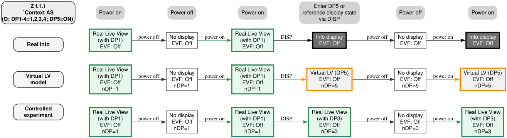
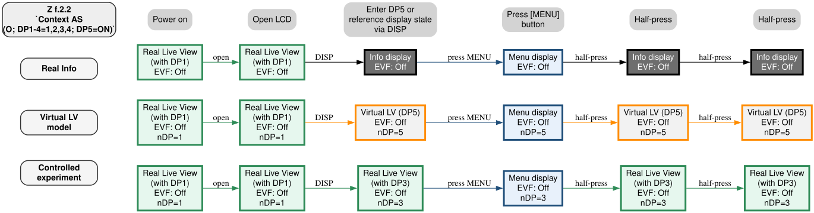
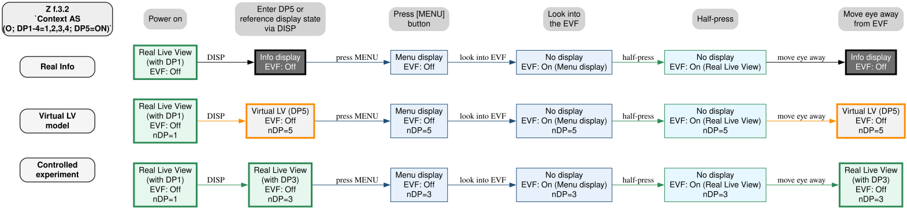
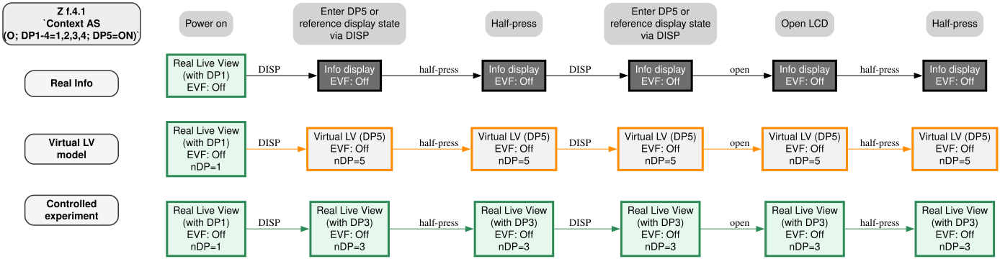
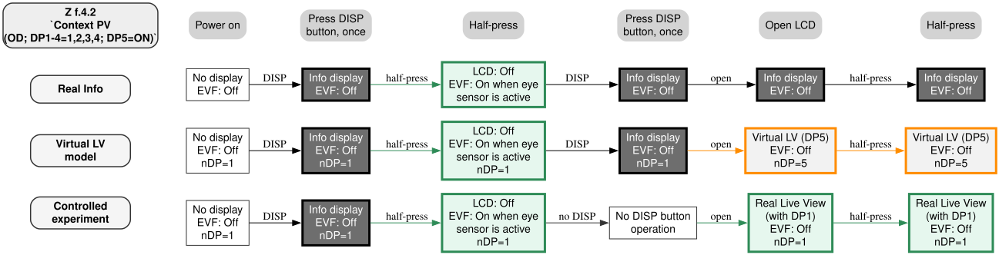
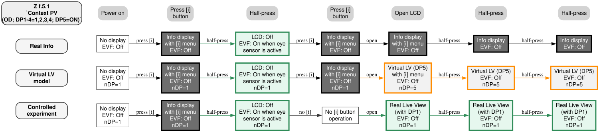
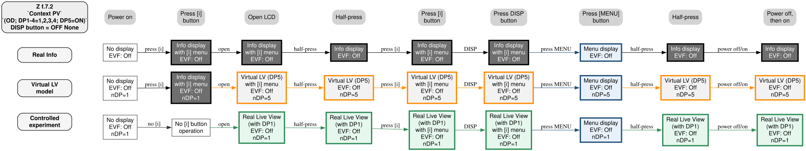

# Controlled Comparisons: Virtual LV (DP5) and Real Live View

> Published: 2026-06-24

---

This section provides the validation results derived from the three hypotheses presented in [Insights](insights.md#verification-based-on-the-three-hypotheses).  
The comparisons are divided into three groups:

**1. Nikon support confirmations involving both DP5 and non-DP5 routes.**  
**2. Direct DP5 route behavior compared with a normal Live View display mode.**  
**3. non-DP5 Info routes that appear to convert into Virtual LV (DP5) when the LCD monitor becomes active.**

- Display 5 route:
  Info reached through the normal Live View display-cycle sequence
  where Display 5 is enabled and selected as one of the shooting display modes.  
- non-Display 5 route:
  Info reached through routes other than the Display 5 cycle, including single-DISP invocation when Live View is not currently displayed, Fn release, [i] menu dismissal, or other display-routing behavior.   
  
  For details, see [Info-State Classification](docs/DB/README.md#info-state-classification).

In the following comparisons, **Virtual LV (DP5)** is used as an interpretive term for Display 5 (“Info”) when it behaves like a retained shooting-display state without an actual through-image. The term does not imply that Live View is physically present behind the Info display. Rather, it indicates that the state appears to follow transition rules similar to ordinary Live View display modes, while lacking the composition image required for practical shooting.  
**Real Live View** refers to ordinary shooting display modes such as Display 1–4, which include a through-image and allow composition.  
The controlled experiments are not intended to reproduce the same entry route exactly. They are used as reference sequences to show how an ordinary Live View display mode behaves under comparable operations.

---

## 1. Nikon Support Confirmations Interpreted Through the “Virtual LV (DP5)” Model
 
The following tables summarize Nikon support confirmations and compare them with controlled reference sequences using ordinary Live View display modes.

---

### Case 01 `Context AS(O; DP1-4=1,2,3,4; DP5=ON)`

| Sequence | Power on |  Power off  | Power on | Enter DP5 or reference display state | Power off | Power on |
| :-- | :-- | :-- | :-- | :-- |:-- |:-- |
| Z f.1.1   **Real Info** | LCD: Real Live View (with DP1) EVF: Off  | LCD: No display EVF: Off    | LCD: Real Live View (with DP1) EVF: Off  | LCD: Info display  EVF: Off | LCD: No display EVF: Off  | LCD: Info display  EVF: Off |
| Z f.1.1   **Virtual LV model**| LCD: Real Live View (with DP1) EVF: Off `nDP=1`  | LCD: No display EVF: Off `nDP=1`   | LCD: Real Live View (with DP1) EVF: Off  `nDP=1`  | LCD: Virtual LV (DP5)  EVF: Off  `nDP=5` | LCD: No display EVF: Off `nDP=5`  | LCD:  Virtual LV (DP5)  EVF: Off `nDP=5` |
| **Controlled experiment** | LCD: Real Live View (with DP1) EVF: Off `nDP=1`  | LCD: No display EVF: Off `nDP=1`    | LCD: Real Live View (with DP1) EVF: Off `nDP=1`  | LCD: Real Live View (with DP3) EVF: Off `nDP=3` | LCD: No display EVF: Off `nDP=3`  | LCD: Real Live View (with DP3) EVF: Off `nDP=3` |

---

### Case 02  `Context AS(O; DP1-4=1,2,3,4; DP5=ON)`

| Sequence | Power on                                   | Open LCD                                   | Enter DP5 or reference display state via DISP | Press [MENU] button           | Half-press                                  | Half-press                                  |
| :------- | :----------------------------------------- | :----------------------------------------- | :------------------------------------------ | :---------------------------- | :------------------------------------------ | :------------------------------------------ |
| Z f.2.2     **Real Info**  | LCD: Real Live View (with DP1) EVF: Off | LCD: Real Live View (with DP1) EVF: Off | LCD: Info display  EVF: Off | LCD: Menu display EVF: Off | LCD: Info display  EVF: Off | LCD: Info display  EVF: Off |
| Z f.2.2   **Virtual LV model** | LCD: Real Live View (with DP1) EVF: Off `nDP=1` | LCD: Real Live View (with DP1) EVF: Off `nDP=1` | LCD: Virtual LV (DP5)  EVF: Off `nDP=5` | LCD: Menu display EVF: Off `nDP=5` | LCD:  Virtual LV (DP5)  EVF: Off `nDP=5` | LCD:  Virtual LV (DP5)  EVF: Off `nDP=5` |
| Controlled experiment | LCD: Real Live View (with DP1) EVF: Off `nDP=1` | LCD: Real Live View (with DP1) EVF: Off `nDP=1` | LCD: Real Live View (with DP3)  EVF: Off `nDP=3` | LCD: Menu display EVF: Off `nDP=3` | LCD: Real Live View (with DP3)  EVF: Off `nDP=3` | LCD: Real Live View (with DP3)   EVF: Off `nDP=3` |

---

###  Case 03 `Context AS(O; DP1-4=1,2,3,4; DP5=ON)`

| Sequence | Power on                                   | Enter DP5 or reference display state via DISP  | Press [MENU] button           | Look into the EVF                         | Half-press                                  | Move eye away from EVF                      |
| :------- | :----------------------------------------- | :------------------------------------------ | :---------------------------- | :---------------------------------------- | :------------------------------------------ | :------------------------------------------ |
| Z f.3.2    **Real Info**  | LCD: Real Live View (with DP1) EVF: Off | LCD: Info display  EVF: Off | LCD: Menu display EVF: Off | LCD: No display EVF: On (Menu display) | LCD: No display EVF: On (Real Live View) | LCD: Info display  EVF: Off |
| Z f.3.2   **Virtual LV model** | LCD: Real Live View (with DP1) EVF: Off `nDP=1` | LCD: Virtual LV (DP5)  EVF: Off `nDP=5` | LCD: Menu display EVF: Off `nDP=5` | LCD: No display EVF: On (Menu display) `nDP=5` | LCD: No display EVF: On (Real Live View) `nDP=5` | LCD: Virtual LV (DP5)  EVF: Off `nDP=5` |
| Controlled experiment | LCD: Real Live View (with DP1) EVF: Off `nDP=1` | LCD: Real Live View (with DP3) EVF: Off `nDP=3` | LCD: Menu display EVF: Off `nDP=3` | LCD: No display EVF: On (Menu display) `nDP=3` | LCD: No display EVF: On (Real Live View) `nDP=3` | LCD: Real Live View (with DP3) EVF: Off `nDP=3` |

---

###  Case 04-1  `Context AS(O; DP1-4=1,2,3,4; DP5=ON)`: Direct DP5 Route under AS

| Sequence | Power on                                   | Enter DP5 or reference display state via DISP | Half-press                                  | Enter DP5 or reference display state via DISP | Open LCD                                    | Half-press                                  |
| :------- | :----------------------------------------- | :------------------------------------------ | :------------------------------------------ | :------------------------------------------ | :------------------------------------------ | :------------------------------------------ |
| Z f.4.1   **Real Info** | LCD: Real Live View (with DP1) EVF: Off | LCD: Info display  EVF: Off | LCD: Info display  EVF: Off | LCD: Info display  EVF: Off | LCD: Info display  EVF: Off | LCD: Info display  EVF: Off |
| Z f.4.1   **Virtual LV model**  | LCD: Real Live View (with DP1) EVF: Off `nDP=1` | LCD: Virtual LV (DP5)  EVF: Off `nDP=5` | LCD: Virtual LV (DP5)  EVF: Off `nDP=5` | LCD: Virtual LV (DP5)  EVF: Off  `nDP=5`| LCD: Virtual LV (DP5)  EVF: Off `nDP=5` | LCD: Virtual LV (DP5)  EVF: Off `nDP=5` |
| Controlled experiment | LCD: Real Live View (with DP1) EVF: Off `nDP=1` | LCD: Real Live View (with DP3) EVF: Off `nDP=3` | LCD: Real Live View (with DP3) EVF: Off `nDP=3` |LCD: Real Live View (with DP3) EVF: Off  `nDP=3`| LCD: Real Live View (with DP3) EVF: Off `nDP=3` | LCD: Real Live View (with DP3) EVF: Off `nDP=3` |

###  Case 04-2  `Context PV(OD; DP1-4=1,2,3,4; DP5=ON)`: non-DP5 Info Route Converted by Open LCD

| Sequence | Power on                    | Press DISP button, once                         | Half-press                  | Press DISP button, once                        | Open LCD                                    | Half-press                                  |
| :------- | :-------------------------- | :------------------------------------------ | :-------------------------- | :------------------------------------------ | :------------------------------------------ | :------------------------------------------ |
| Z f.4.2   **Real Info** | LCD: No display EVF: Off | LCD: Info display  EVF: Off | LCD: Off EVF: On when eye sensor is active | LCD: Info display  EVF: Off | LCD: Info display EVF: Off | LCD: Info display EVF: Off |
| Z f.4.2   **Virtual LV model** | LCD: No display EVF: Off  `nDP=1`| LCD: Info display  EVF: Off `nDP=1` | LCD: Off EVF: On when eye sensor is active `nDP=1` | LCD: Info display  EVF: Off `nDP=1` | LCD: Virtual LV (DP5) EVF: Off `nDP=5` | LCD: Virtual LV (DP5) EVF: Off `nDP=5` |
| Controlled experiment | LCD: No display EVF: Off `nDP=1` | LCD: Info display  EVF: Off `nDP=1` | LCD: Off EVF: On when eye sensor is active `nDP=1` |  No DISP button operation |LCD: Real Live View (with DP1) EVF: Off `nDP=1` | LCD: Real Live View (with DP1) EVF: Off `nDP=1` |

---

###  Case 05-1  `Context PV(OD; DP1-4=1,2,3,4; DP5=ON)`: non-DP5 [i] Route Converted into Virtual LV (DP5)

| Sequence | Power on                    | Press [i] button                            | Half-press                  | Press [i] button                            | Open LCD                                    | Half-press                                  | Half-press                                  |
| :------- | :-------------------------- | :------------------------------------------ | :-------------------------- | :------------------------------------------ | :------------------------------------------ | :------------------------------------------ | :------------------------------------------ |
| Z f.5.1   **Real Info** | LCD: No display EVF: Off | LCD: Info display with [i] menu EVF: Off | LCD: Off  EVF: On when eye sensor is active | LCD: Info display with [i] menu EVF: Off | LCD: Info display with [i] menu EVF: Off | LCD: Info display  EVF: Off | LCD: Info display  EVF: Off |
| Z f.5.1   **Virtual LV model** | LCD: No display EVF: Off `nDP=1` | LCD: Info display with [i] menu EVF: Off  `nDP=1`|LCD: Off EVF: On when eye sensor is active  `nDP=1`| LCD: Info display with [i] menu EVF: Off `nDP=1` | LCD:  Virtual LV (DP5) with [i] menu EVF: Off  `nDP=5` | LCD:  Virtual LV (DP5)  EVF: Off  `nDP=5`| LCD:  Virtual LV (DP5)  EVF: Off  `nDP=5`|
| Controlled experiment | LCD: No display EVF: Off  `nDP=1`| LCD: Info display with [i] menu EVF: Off `nDP=1` |LCD: Off EVF: On when eye sensor is active `nDP=1` |  No [i] button operation  | LCD: Real Live View (with DP1) EVF: Off `nDP=1` |LCD: Real Live View (with DP1) EVF: Off `nDP=1` | LCD: Real Live View (with DP1) EVF: Off `nDP=1` |

---

###  Case 07  `Context PV(OD; DP1-4=1,2,3,4; DP5=ON), DISP button = "OFF None"`: non-DP5 [i] Route Converted into Virtual LV (DP5)

| Sequence | Power on                    | Press [i] button                           | Open LCD                                     | Half-press                  | Press [i] button                            | Press DISP button                           | Press [MENU] button        | Half-press                                  | Power off, then on                     |
| :------- | :-------------------------- | :------------------------------------------ | :-------------------------- | :------------------------------------------ | :------------------------------------------ | :------------------------------------------ | :------------------------------------------ | :------------------------------------------ | :------------------------------------------ |
| Z f.7.2 ` `DISP button = "OFF None"` ` **Real Info** | LCD: No display EVF: Off | LCD: Info display with [i] menu EVF: Off | LCD: Info display with [i] menu EVF: Off |  LCD: Info display  EVF: Off  | LCD: Info display with [i] menu  EVF: Off   | LCD: Info display  with [i] menu  EVF: Off   | LCD: Menu display EVF: Off | LCD: Info display  EVF: Off | LCD: Info display  EVF: Off |
| Z f.7.2 ` `DISP button = "OFF None"`  **Virtual LV model** | LCD: No display EVF: Off `nDP=1` | LCD: Info display with [i] menu EVF: Off `nDP=1` | LCD: Virtual LV (DP5) with [i] menu EVF: Off `nDP=5` |  LCD: Virtual LV (DP5)  EVF: Off `nDP=5` | LCD: Virtual LV (DP5) with [i] menu  EVF: Off `nDP=5` | LCD: Virtual LV (DP5)  with [i] menu  EVF: Off `nDP=5`  | LCD: Menu display EVF: Off `nDP=5` | LCD: Virtual LV (DP5)  EVF: Off  `nDP=5`| LCD: Virtual LV (DP5)  EVF: Off  `nDP=5`|
| Controlled experiment | LCD: No display EVF: Off `nDP=1`|  No [i] button operation | LCD: Real Live View (with DP1) EVF: Off `nDP=1` | LCD: Real Live View (with DP1) EVF: Off `nDP=1`  |  LCD: Real Live View (with DP1) with [i] menu EVF: Off `nDP=1`  | LCD: Real Live View (with DP1) with [i] menu EVF: Off `nDP=1`   | LCD: Menu display EVF: Off `nDP=1` | LCD: Real Live View (with DP1) EVF: Off `nDP=1` | LCD: Real Live View (with DP1) EVF: Off `nDP=1` |

---

Across these confirmations, a consistent pattern appears:

- When Display 5 is selected directly through the display cycle, it behaves like a retained shooting-display state.
- When an Info display is reached through a non-DP5 route while the LCD is docked, shutter-button half-press can still clear the display and allow EVF Live View recovery.
- However, once the LCD monitor is opened from that Info state, the same visually similar Info display behaves like Virtual LV (DP5): shutter-button half-press no longer restores Live View.
- In the controlled reference sequences, ordinary Real Live View display modes remain composition-capable across comparable operations.

This suggests that the key distinction is not merely whether the visible screen says “Info,” but whether the system has treated that Info state as a retained shooting-display state.

---

## 2. Direct DP5 route behavior compared with a normal Live View display mode.

| Sequence | Open LCD | Enter DP5 or reference display state via DISP | Close LCD  | Open LCD |
| :-- | :-- | :-- | :-- | :-- |
| Case B3 Steps 8–11 `Context PV (OD; DP1-4=1,2,3,4; DP5=ON)` | LCD: Real Live View (with DP2) EVF: Off | LCD: Virtual LV (DP5) EVF: Off | LCD: Virtual LV (DP5); turns off when eye sensor is active EVF: On when eye sensor is active | LCD: Virtual LV (DP5) EVF: Off |
| Controlled experiment | LCD: Real Live View (with DP2) EVF: Off | LCD: Real Live View (with DP3) EVF: Off | LCD: Off EVF: On when eye sensor is active | LCD: Real Live View (with DP3) EVF: Off |

| Sequence | Open LCD | Enter DP5 or reference display state via DISP | Half-press | Close LCD  | Open LCD |
| :-- | :-- | :-- | :-- | :-- | :-- |
| Case B3 Steps 16–20 `Context PV (OD; DP1-4=1,2,3,4; DP5=ON)` | LCD: Real Live View (with DP2) EVF: Off | LCD: Virtual LV (DP5) EVF: Off | LCD: Virtual LV (DP5) EVF: Off | LCD: Virtual LV (DP5); turns off when eye sensor is active EVF: On when eye sensor is active | LCD: Virtual LV (DP5) EVF: Off |
| Controlled experiment | LCD: Real Live View (with DP2) EVF: Off | LCD: Real Live View (with DP3) EVF: Off | LCD: Real Live View (with DP3) EVF: Off | LCD: Off EVF: On when eye sensor is active | LCD: Real Live View (with DP3) EVF: Off |

| Sequence | Open LCD | Press [i] button | Power off, then on | Enter DP5 or reference display state via DISP | Power off, then on |
| :-- | :-- | :-- | :-- | :-- | :-- |
| Case B3 Steps 66–70 `Context PV (OD; DP1-4=1,2,3,4; DP5=ON)` | LCD: Real Live View (with DP2) EVF: Off |  LCD: Real Live View with [i] menu EVF: Off| LCD: Real Live View (with DP2) EVF: Off | LCD: Virtual LV (DP5) EVF: Off | LCD: Virtual LV (DP5) EVF: Off |
| Controlled experiment | LCD: Real Live View (with DP2) EVF: Off |  LCD: Real Live View with [i] menu EVF: Off| LCD: Real Live View (with DP2) EVF: Off | LCD: Real Live View (with DP3) EVF: Off | LCD: Real Live View (with DP3) EVF: Off |

| Sequence | Close LCD  | Enter DP5 or reference display state via DISP |  Power off, then on |
| :-- | :-- | :-- | :-- |
| Case B3 Steps 102–104 `Context MO (-; DP1-4=1,2,3,4; DP5=ON)` | LCD: Real Live View (with DP1) EVF: Off | LCD: Virtual LV (DP5) EVF: Off | LCD: Virtual LV (DP5) EVF: Off | 
| Controlled experiment | LCD: Real Live View (with DP2) EVF: Off | LCD: Real Live View (with DP3) EVF: Off | LCD: Real Live View (with DP3) EVF: Off |

Note: In the controlled experiment rows, the [i] or DISP operation is omitted. The camera is assumed to have been in the indicated Real Live View display mode before the comparable LCD close/open or power-cycle sequence.

---

## 3. non-DP5 Info routes that appear to convert into Virtual LV (DP5) when the LCD monitor becomes active.

| Sequence | Close LCD  | Press [i] button | Press [i] button | Open LCD | Close LCD  | Power off, then on | Open LCD |
| :-- | :-- | :-- | :-- | :-- | :-- | :-- | :-- |
| Case B3 Steps 38–43 `Context PV (OD; DP1-4=1,2,3,4; DP5=ON)`  | LCD: No display EVF: Off | LCD: Info display with [i] menu EVF: Off | LCD: Info display (non-DP5 route) EVF: Off | LCD: Virtual LV (DP5) EVF: Off | LCD: Virtual LV (DP5); turns off when eye sensor is active EVF: On when eye sensor is active | LCD: Off EVF: Off | LCD: Virtual LV (DP5) EVF: Off |
| Controlled experiment | LCD: No display EVF: Off | No [i] button operation | Display 3 is assumed to have been selected beforehand | LCD: Real Live View (with DP3) EVF: Off | LCD: Off EVF: On when eye sensor is active | LCD: Off EVF: Off | LCD: Real Live View (with DP3) EVF: Off |

| Sequence | Close LCD  | Press [i] button | Open LCD | Close LCD  | Power off, then on | Open LCD |
| :-- | :-- | :-- | :-- | :-- | :-- | :-- |
| Case B3 Steps 48–52 `Context PV (OD; DP1-4=1,2,3,4; DP5=ON)`  | LCD: No display EVF: Off | LCD: Info display with [i] menu EVF: Off | LCD: Virtual LV (DP5) with [i] menu EVF: Off | LCD: Virtual LV (DP5) with [i] menu; turns off when eye sensor is active EVF: On when eye sensor is active | LCD: Off EVF: Off | LCD: Virtual LV (DP5) EVF: Off |
| Controlled experiment | LCD: No display EVF: Off | No [i] button operation | LCD: Real Live View (with DP2) EVF: Off | LCD: Off EVF: On when eye sensor is active | LCD: Off EVF: Off | LCD: Real Live View (with DP2) EVF: Off |

| Sequence | Close LCD  | Press DISP button, once | Open LCD | Close LCD  | Power off, then on | Open LCD |
| :-- | :-- | :-- | :-- | :-- | :-- | :-- |
| Case B3 Steps 57–61 `Context PV (OD; DP1-4=1,2,3,4; DP5=ON)`  | LCD: No display EVF: Off | LCD: Info display EVF: Off | LCD: Virtual LV (DP5)  EVF: Off | LCD: Virtual LV (DP5); turns off when eye sensor is active EVF: On when eye sensor is active | LCD: Off EVF: Off | LCD: Virtual LV (DP5) EVF: Off |
| Controlled experiment | LCD: No display EVF: Off | No DISP button operation | LCD: Real Live View (with DP2) EVF: Off | LCD: Off EVF: On when eye sensor is active | LCD: Off EVF: Off | LCD: Real Live View (with DP2) EVF: Off |

Note: In the controlled experiment rows, the [i] or DISP operation is omitted. The camera is assumed to have been in the indicated Real Live View display mode before the comparable LCD close/open or power-cycle sequence.

