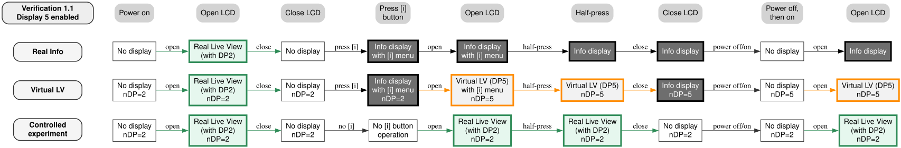
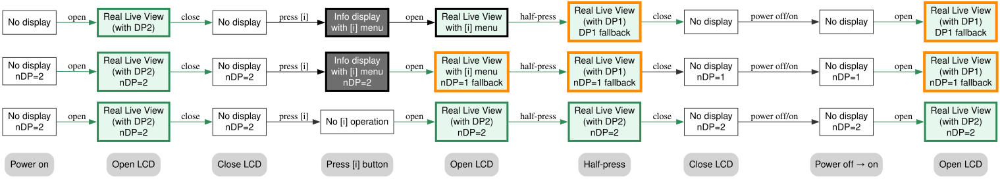

# Insights & Hypotheses

> Published: 2026-06-24 | Last Updated: 2026-06-26

---

The starting point of this repository was a personal experience with the Nikon Z f: the LCD monitor became fixed on the Info display, and recovering a composition-capable Live View became unexpectedly difficult.

At first, my goal was simply to understand the camera’s behavior — especially the behavior of the Info display — through detailed state-transition observations. 
As the observations progressed, however, the issue began to appear broader than a single isolated anomaly. It seemed to touch on a wider question concerning the Nikon Z-series interface, the transition from DSLR-era operating assumptions to mirrorless display logic, and, ultimately, the identity of a camera as a photographic tool.

The following discussion is based on state-transition observations using actual cameras, responses received from Nikon support, and wording found in Nikon manuals.

The support exchange with Nikon is still ongoing. The content of this document may therefore be revised as further responses are received.

---

## Critical Issues

The concerns investigated in this repository all relate to the behavior of the Info display during still photography.

* **Failure to recover through shutter-button half-press**
  Under certain conditions, half-pressing the shutter button does not restore Live View. The LCD monitor remains fixed on the Info display.

* **Loss of immediate Live View recovery without warning**
  Under certain customization conditions, the camera can enter a state in which immediate recovery to Live View becomes difficult, without any warning from the system.

* **Persistence across power cycling and battery removal**
  Under certain conditions, the LCD display state is not reset by power cycling or even by removing the battery. The Info display can persist as if retained across power states.

* **Loss of predictability**
  The outcome of an operation can be difficult to predict from the current visible screen alone. This is especially apparent in behaviors involving the Info display, where visually similar states may lead to different subsequent transitions.

---

## A Working Explanation

The behaviors described above can be explained consistently by assuming that there are at least two functionally different kinds of Info-display states.

One behaves as an Info state with persistent properties. The other appears visually similar, but does not initially possess those persistent traits.   
For example, the screen selectable as “Display 5 / Info” in the custom monitor shooting-display settings appears to be the Info state that carries this persistence. In addition to the Z f, models equipped with this Display 5 / Info include the Z9 and Z8, and it can be described as a new Info screen.   
On the other hand, the Info screen that does not initially possess persistent traits exhibits behavior similar to the Info screen adopted in DSLR cameras, representing the legacy Info screen.

One major cause of the problem is that these nearly identical Info states transition from a non-persistent state into the persistent Display 5 / Info state depending on the display settings, LCD open/closed state, and preceding operations, and that this transition occurs without showing any visible change on the surface.

Another cause is that Display 5 / Info appears to be treated as one of the shooting-display states.   
Because it is treated as a shooting-display state within the system despite not containing a through-image (Live View), a shutter-button half-press does not necessarily trigger a transition to the Live View display, and as a result, it feels to the user as if it has become fixed. This is the persistent characteristic seen in Display 5 / Info, and according to this interpretation, the camera's response has not disappeared (frozen).

This working explanation can account for both the apparent fixation and the difficulty of predicting the next transition from the visible screen alone. The discussion below develops this interpretation in more detail, including its historical background, terminology issues, support-confirmed behaviors, and possible implications for future camera interface design.

---

## Historical Background

During the transition from DSLR cameras to mirrorless cameras, the treatment of the Info display in Nikon manuals appears to have changed.

In DSLR-era manuals, methods for dismissing the Info display — including shutter-button half-press and display timeout — were described explicitly. In contrast, around the beginning of the Z-series mirrorless system, such descriptions appear to have disappeared from the manuals, including some DSLR manuals from the same period.

At the same time, the term **“shooting display”** became central in Z-series documentation. Nikon’s manuals define it as follows:

> Throughout this document, the display in the camera monitor and viewfinder during shooting is referred to as the “shooting display”.

In the Z-series, at least part of what appears as the Info display seems to have been incorporated into this broader category of “shooting display”.

This shift is central to the hypotheses below.

---

## Hypotheses

To explain the unusual behavior of the Info display on the Nikon Z f, I propose three hypotheses.

These hypotheses do not claim to describe Nikon’s actual firmware implementation. They are explanatory models intended to describe the observed behavior consistently.

---

### Hypothesis 1: There Are Two Kinds of Info Display

> There appear to be two kinds of Info display that are visually indistinguishable to the user, but behave differently as internal display states.

This is the first hypothesis.

#### 1. Info as Display 5 of the “shooting display”

First, "Display 5 Info" is the Info display that appears as Display 5, configured under:

> [CUSTOM SETTINGS MENU] > [d19 Custom monitor shooting display]

It is reached mainly by repeatedly pressing the DISP button while the camera is in an active shooting display state.

#### 2. A non-DP5 Info-like state inherited from DSLR-era behavior 

Second, "Non-DP5 Info" is an Info display that appears outside the normal Display 5 route.

Even if Display 5 is disabled in [CUSTOM SETTINGS MENU] > [d19 Custom monitor shooting display], it can still appear.
It can also appear through routes other than the normal DISP display-cycle route, such as the [i] button route or Fn / white-balance adjustment route.

Because this display behaves more like the DSLR-era Info display — for example, it can be cleared by shutter-button half-press before the LCD monitor becomes active — it is useful to distinguish it from Display 5  Info.

In the state-transition tables in this repository, these are distinguished as:

* `Info display (explicit DP5 route)`
* `Info display (non-DP5 route)`

For details, see [Info-State Classification](docs/DB/README.md#info-state-classification).

#### Structural Concern

Display 1 through Display 4 are ordinary Live View shooting displays. They contain a through-image from the lens.  
Display 5, by contrast, is a full-screen graphical Info display. It does not contain a through-image.

This raises an important concern: can a full-screen Info display with no through-image be treated as a “shooting display” in the same sense as Display 1 through Display 4?

Regarding this, it is useful to look at Nikon’s own description of Custom Setting d19, “Custom monitor shooting display.”  
The manual states that items from Display 2 through Display 5 can be selected or deselected, and that only checked displays can be accessed by pressing the DISP button during shooting.
This demonstrates that Nikon treats Display 5 / Info, at least in this menu context, as part of the monitor shooting-display system.  

At the same time, Custom Setting d20, “Custom viewfinder shooting display,” only allows selection from Display 1 through Display 4, and Display 5 does not exist there.  
This asymmetry can perhaps be viewed as highlighting the ambiguous positioning of Display 5 / Info.

However, despite these concerns, treating Display 5 as one of the shooting displays explains a substantial portion of the observed behavior.

---

### Hypothesis 2: Shutter Half-Press Returns to Display `nDP`, Not Necessarily to Live View

In DSLR-era operation, the shutter button had a special role. Except for critical conditions such as card errors, half-pressing the shutter button was generally understood as an immediate return to a shooting-ready state.

DSLR manuals also explicitly described shutter-button half-press as one way to dismiss the Info display.

However, in the confirmations obtained from Nikon support, Nikon explicitly confirmed that after passing through an LCD-opening operation, the Info screen does not turn off with a half-press and instead remains fixed.
This suggests that the meaning of shutter-button half-press has changed.

See [Z f.4.2](Nikon_Support_Confirmation_Notes/Nikon_Support_Confirmation_Notes.md#case04).

#### A Logical Inconsistency in the Current Behavior

Consider the behavior described in [Z f.2.1 and Z f.2.2](Nikon_Support_Confirmation_Notes/Nikon_Support_Confirmation_Notes.md#case02).

* In the first part of Z f.2.2, when the Info display is shown, pressing MENU opens the MENU screen.
  In this sense:
  `MENU > Info`

* In Z f.2.1, when the MENU screen is shown, half-pressing the shutter button dismisses MENU and returns to Live View.
  In this sense:
  `Half-press > MENU`

So far, this is consistent with long-standing camera operation.

However:

* In the second part of Z f.2.2, after MENU is dismissed, the camera returns to the Info display. A further half-press does not clear the Info display.
  In this sense:
  `Info > Half-press`

This produces a circular priority relationship:

> `Info > Half-press > MENU > Info`

From a user-observable standpoint, this is difficult to reconcile if shutter-button half-press is assumed to mean unconditional recovery to Live View.

#### Introducing the Conceptual Variable `nDP`

To resolve this inconsistency, I introduce a conceptual variable:

* **`nDP`**: an abstract display-index state.
When the camera is in an active shooting state, it represents the current display number.
When the camera is not in an active shooting state, it represents the most recently retained or next recovery-target display number.

This leads to the second hypothesis:

> Half-press does not necessarily mean “return to Live View.”
> Instead, it means “return to one of the shooting displays from Display 1 through Display 5 indicated by nDP, including its associated background display if one exists.”

In other words, under this model, the act of a half-press is not considered an operation to "return to Live View" with that Live View accompanied by the layers specified in Display 1 through Display 4.Instead, it is considered an operation to "return to any of the retained shooting-display indices from Display 1 through Display 5," with that display index sometimes accompanied by a Live View.

Based on this Hypothesis 2, the previously discussed priority relationship can be rewritten as follows:

> ”**Shutter-button half-press means “return to the shooting display indicated by `nDP`, including its associated background display if one exists.**”  
> ”**It does not necessarily mean “return to Live View.**”

Under this model, half-press is not an unconditional command to interrupt the current display state and force a return to a through-image Live View in Display 1 through Display 4.

Rather, it returns to the retained shooting-display index — Display 1 through Display 5 — whether or not that display index is associated with a through-image.

The priority relationship can then be rewritten as:

> `Shooting display nDP = Half-press > MENU > Info`

Combining this with Hypothesis 1, if `nDP = 5`, the result becomes:

> `Display 5 Info = Half-press > MENU > non-DP5 Info`

If nDP = 1 through nDP = 4, a half-press will appear to return the system to a normal Live View display.   
However, if nDP = 5, the recovery target is Display 5 / Info itself, which lacks a Live View image.
Consequently, even when performing a half-press, the system may transition to the Info screen, or appear to freeze and remain stuck on the Info screen without any change.
 
In this manner, the observed Info-fixation can be explained without introducing any logical contradictions into the internal model.

---

### Hypothesis 3: LCD Opening / Closing Can Rewrite the Display Index

Hypothesis 1 distinguishes non-DP5 Info from Display 5.

However, if a non-DP5 Info display is shown while the LCD monitor is docked, and the LCD monitor is then opened, the resulting display becomes visually indistinguishable from Display 5.

Moreover, in [Case B3](docs/DB/Case_B3_Cornering.md), an Info display that did not behave as a fixed Display 5 state before LCD opening began to behave as a persistent Display 5-like state after the LCD monitor was opened.

Nikon support also suggested disabling Display 5 as a workaround for the fixation problem, which further supports the idea that Display 5 plays a central role.

To explain this transformation, as well as the Display-index reset observed in [Z f.6.1](Nikon_Support_Confirmation_Notes/Nikon_Support_Confirmation_Notes.md#case06), I propose the third hypothesis:

> **When the LCD monitor is opened or closed, the system may update the conceptual display-index state `nDP`, and the subsequent display is drawn according to the updated value.**

Again, `nDP` is not a claim about Nikon’s actual firmware variable. It is a conceptual tool for describing the observed behavior.

#### 1. LCD Monitor Opened: Variable Update Followed by Display Rendering

Suppose the LCD monitor is docked, and a non-DP5 Info display is shown. If the most recent Live View display index was Display 2, the conceptual value is:

> `nDP = 2`

When the LCD monitor is opened, the camera detects both:

* an Info display is currently present
* the LCD monitor is entering an active shooting-display context

Under the hypothesis, the following sequence occurs:

1. **Variable update**
Because the Info display is continuing into the active LCD shooting context, the system updates the conceptual display index to:

   > `nDP = 5`

2. **Display-setting check and fallback**
If Display 5 is enabled, the system maintains `nDP = 5`.  
If Display 5 is disabled, the system cannot draw Display 5 and falls back to Display 1, setting `nDP = 1`.

3. **Display rendering**
The LCD then displays either persistent Display 5 Info or Live View with Display 1.

This model explains both:

* Info fixation when Display 5 is enabled
* Display-index reset to Display 1 when Display 5 is disabled

#### 2. LCD Monitor Closed

When the LCD monitor is closed again, the behavior depends on the retained `nDP`.

* If `nDP = 5`, the system returns to an Info state, maintaining nDP = 5 as the recovery target for Display 5.
* If `nDP = 1`, as in the case when Display 5 is disabled, the LCD turns off. At this point, the history of the previous index, Display 2, no longer remains.

This explains why disabling Display 5 prevents fixation,yet fails to preserve the previous Live View display index.

---

## Verification Based on the Three Hypotheses

The following comparisons use the three hypotheses above, together with the conceptual model of **Virtual LV (DP5)**.

---

### Virtual LV (DP5)

The actual Display 5 Info screen contains no through-image. It is a full-screen graphical display.

However, for explanatory purposes, imagine that Display 5 were a transparent overlay and that a live through-the-lens image existed behind it. This imagined state is called:

> **Virtual LV (DP5)**

This term does not mean that Live View is actually present behind the Info display. It is a conceptual model used to distinguish Display 5 Info screen behavior from the non-DP5 Info-like state.

Introducing the concept of a "Virtual LV (DP5)" makes it easier to understand how Display 5 behaves as if it were a shooting display with an active Live View, even though it does not actually provide one.

---

### Verification 1: LCD Opening, Info Fixation, and Display-Index Reset

The following comparison examines three layers:

* the actual observed display transition
* the explanatory Virtual LV / `nDP` model
* a controlled experiment without the [i] route

#### Assumptions

* All sequences begin with Display 2 as the most recent Live View display state.
* The controlled experiment omits the [i] button operation.
* The context is based on:

> `Context PV(OD; DP1-4=1,2,3,4)`

---

### Verification 1.1: Display 5 Enabled

| Sequence                  | Power on              | Open LCD                             | Close LCD             | Press [i] button                      | Open LCD                                  | Half-press                           | Close LCD               | Power off, then on    | Open LCD                             |
| :------------------------ | :-------------------- | :----------------------------------- | :-------------------- | :------------------------------------ | :---------------------------------------- | :----------------------------------- | :---------------------- | :-------------------- | :----------------------------------- |
| **Real Info**             | No display            | Real Live View (with DP2)            | No display            | Info display with [i] menu            | Info display with [i] menu                | Info display                         | Info display            | No display            | Info display                         |
| **Virtual LV model**      | No display `nDP=2` | Real Live View (with DP2) `nDP=2` | No display `nDP=2` | Info display with [i] menu `nDP=2` | Virtual LV (DP5) with [i] menu `nDP=5` | Virtual LV (DP5) `nDP=5`          | Info display `nDP=5` | No display `nDP=5` | Virtual LV (DP5) `nDP=5`          |
| **Controlled experiment** | No display `nDP=2` | Real Live View (with DP2) `nDP=2` | No display `nDP=2` | No [i] operation                      | Real Live View (with DP2) `nDP=2`      | Real Live View (with DP2) `nDP=2` | No display `nDP=2`   | No display `nDP=2` | Real Live View (with DP2) `nDP=2` |

**Figure: Comparison of actual Info behavior, the Virtual LV (DP5) model, and a controlled Live View reference sequence when Display 5 is enabled.**

#### Discussion

Imagine the movement of Virtual LV (DP5).

Before the LCD monitor is opened, the Info display behaves like a non-DP5 Info state. When the LCD monitor is opened, however, that Info state crosses into the active LCD shooting-display context. Under the model, the conceptual display index changes to `nDP = 5`, and the state becomes Virtual LV (DP5).

If the LCD monitor is closed again, the through-image component disappears, and the display returns to an opaque Info state. Yet the recovery target remains `nDP = 5`.

This explains why shutter-button half-press does not change the display. From the system’s point of view, the camera may already be in the retained shooting display: Display 5. To move away from Display 5, the user must explicitly change the shooting display, typically by pressing the DISP button. If the DISP button has been disabled by customization, the immediate recovery route can be lost.

---

### Verification 1.2: Display 5 Disabled

| Sequence                  | Power on              | Open LCD                             | Close LCD             | Press [i] button                      | Open LCD                                | Half-press                           | Close LCD             | Power off, then on    | Open LCD                             |
| :------------------------ | :-------------------- | :----------------------------------- | :-------------------- | :------------------------------------ | :-------------------------------------- | :----------------------------------- | :-------------------- | :-------------------- | :----------------------------------- |
| **Real Info**             | No display            | Real Live View (with DP2)            | No display            | Info display with [i] menu            | Real Live View with [i] menu            | Real Live View (with DP1)            | No display            | No display            | Real Live View (with DP1)            |
| **Display-index model**      | No display `nDP=2` | Real Live View (with DP2) `nDP=2` | No display `nDP=2` | Info display with [i] menu `nDP=2` | Real Live View with [i] menu `nDP=1` | Real Live View (with DP1) `nDP=1` | No display `nDP=1` | No display `nDP=1` | Real Live View (with DP1) `nDP=1` |
| **Controlled experiment** | No display `nDP=2` | Real Live View (with DP2) `nDP=2` | No display `nDP=2` | No [i] operation                      | Real Live View (with DP2) `nDP=2`    | Real Live View (with DP2) `nDP=2` | No display `nDP=2` | No display `nDP=2` | Real Live View (with DP2) `nDP=2` |

**Figure: Comparison of actual behavior, the display-index / fallback model, and a controlled Live View reference sequence when Display 5 is disabled. Green fill indicates that a through-image Live View is present; orange borders indicate fallback to Display 1 rather than preservation of the previous Display 2 state.**

#### Discussion: The Display-Index Reset in CASE 06

When Display 5 is disabled, the Info fixation itself is avoided. However, the previously active Display 2 is not preserved. The camera returns to Display 1.

This can be explained by the model:

> update toward `nDP = 5` → Display 5 disabled → fallback to `nDP = 1` → render Display 1

In other words, disabling Display 5 prevents fixation, but it does not necessarily preserve the previous Live View display index.

---

### Verification 2

The same hypotheses were also compared against Nikon support confirmations and the observations in:
[Case B3: Cornering the Shadow: A Trace from the Past](docs/DB/Case_B3_Cornering.md).

For additional comparisons, see:

> [insights-vDP5](insights-vDP5.md#case05)

Many of these transitions resemble the controlled experiments closely when interpreted through the three hypotheses and the Virtual LV (DP5) model.

---

## Discussion Based on the Hypotheses

The purpose of the three hypotheses is not to identify Nikon’s actual internal code. The purpose is to provide a coherent explanatory structure for the observed behavior.

Using the concepts of non-DP5 Info, Display 5, Virtual LV (DP5), and the conceptual display-index state `nDP`, the major concerns listed at the beginning of this document can be explained without contradiction.

However, this also means that understanding and predicting this camera’s behavior may require the user to imagine invisible display states and invisible display-history variables.

That is a significant burden for a photographic tool.

---

## Market and User Reaction

One question naturally arises:

If this behavior is structurally significant, why have there been relatively few public complaints about Display 5 or the Info display?

A possible explanation lies in the display settings that most users are likely to use.

---

### Pattern A: Default Automatic Display Switching or Monitor-Only Use

Relevant contexts include:

* `Context AS(O; DP1-4=1,2,3,4; DP5=ON)`
* `Context MO(-; DP1-4=1,2,3,4; DP5=ON)`

In these contexts, the LCD monitor is usually active as a shooting display when the photographer is not using the EVF.

The Info display that appears to the user is therefore usually Display 5 itself, reached through the normal DISP cycle. If the user wants to return to Live View, pressing DISP again will normally do so.

Many users may therefore experience a moment of confusion — for example, when half-press does not clear the Info display — but resolve it unconsciously by pressing DISP.

In addition, many users may simply not use the Info display often during active shooting.

As a result, the behavior may be overlooked or absorbed into habit.

Nevertheless, the fixation is still present. For example, as shown in [Z f.8.2](Nikon_Support_Confirmation_Notes/Nikon_Support_Confirmation_Notes.md#case08), the Info display can remain visible even during continuous shooting.

---

### Pattern B: Prioritize Viewfinder with Automatic Monitor Display Switch Set to “On”

Relevant context:

* `Context PV(O; DP1-4=1,2,3,4; DP5=ON)`

In this context, the LCD monitor does not normally become an active Live View shooting display.

As a result, the Display 5 behavior may not appear on the LCD monitor in ordinary use. The Info display that appears may behave more like the non-DP5 Info state and can be dismissed by actions such as a half-press or a power cycle.

---

### Pattern C: Prioritize Viewfinder with Automatic Monitor Display Switch Set to “On (when monitor docked)”

Relevant context:

* `Context PV(OD; DP1-4=1,2,3,4; DP5=ON)`

This is the most problematic context encountered in this repository.

In this setting, both types of Info display can appear:

* Display 5 as a shooting display
* non-DP5 Info-like states reached through routes such as [i] or Fn

Moreover, the camera’s active shooting-display state can change depending on the physical opening and closing of the LCD monitor.

This makes it possible for non-DP5 Info to cross into an active LCD shooting-display context and become Display 5-like in behavior. This is where fixation and display-index reset become most apparent.

This issue is particularly likely to manifest when a user frequently changes exposure, white balance, AF, and other settings manually via the Info display, or when they constantly switch between the LCD and the viewfinder. However, standard users are unlikely to operate the camera in this manner.  
Furthermore, the “On (when monitor docked)” option is a relatively new feature, introduced in Firmware C Version 3.00 released in October 2025.
It was only after this option became available that I began using the Z f extensively with this setting, which ultimately brought the Info-fixation behavior to light.  

---

I suspect these factors explain why the Info-fixation has not been widely recognized as a major problem at this time.  
However, this does not justify leaving the issue unaddressed, as will be discussed later in this document.

---

## Speculation About Nikon’s Internal Recognition of the Issue

*The following is speculation based on observed behavior and the history of my support exchange with Nikon. It is not a claim about Nikon’s internal development process.*

It is possible that the UI consequences of integrating Display 5 into the shooting-display system were not fully recognized at first.

Several points suggest this possibility:

* **Initial support uncertainty**
When I first reported that the Info display could become fixed and prevent recovery to Live View, the support representative could not immediately provide a clear explanation or recovery method.

* **Apparent misunderstanding in early responses**
Early email responses included explanations that appeared to misunderstand the basic monitor / viewfinder switching behavior under the relevant settings.

* **A workaround suggested only after a long exchange**
After many months of correspondence, Nikon suggested disabling Display 5 as a workaround for the Info fixation problem.

If the behavior had been fully anticipated as an intended specification from the beginning, one might expect the support response and documentation to have addressed it more directly.

The later suggestion to disable Display 5 may indicate that the role of Display 5 in the recovery problem was recognized only after further examination.

Again, this is merely speculation.

---

## Manual Wording and the Meaning of “Shooting Display”

There are also traces of ambiguity in the manuals themselves.

### About the white-balance fine-tuning

In the Japanese Z f Reference Guide, the white-balance fine-tuning section states:

> Fn ボタンを放すと、微調整値を決定して撮影画面に戻ります。
> “When the Fn button is released, the fine-tuning value is confirmed and the camera returns to the shooting display.”

In contrast, the corresponding section in the English version states only the following, avoiding any explicit mention of the destination display:

> The selected setting takes effect when the Fn button is released.

Under some settings, releasing the Fn button can return the LCD monitor to an Info display that is not Display 5, especially when Display 5 is disabled and the LCD monitor is docked.

If such an Info display is not a “shooting display,” then the Japanese wording becomes difficult to apply literally.

If it is a “shooting display,” then the category of “shooting display” includes an Info display even when Display 5 has been disabled.

Either interpretation raises questions about the precise relationship among:

* Info display
* Display 5
* shooting display
* through-image Live View

### In the description of assignable custom-control functions

A further terminology problem appears in the description of assignable custom-control functions.

In the English manual, the function “Cycle live view info display” is described as cycling the shooting display. The manual states that the type and content of the available displays can be chosen using the custom monitor and viewfinder shooting-display settings. In actual monitor operation, this cycling can include Display 5 / Info.

By contrast, the separate function “Live view info display off” is described as hiding icons and other information in the shooting display. In practice, this function can hide the overlay information from through-image Live View displays, but it does not hide Display 5 / Info itself.

This creates an apparent inconsistency. In one function name, “live view info display” appears to include the Display 5 / Info screen as part of the cycle. In the other function name, “live view info display” appears to refer only to overlay information on through-image Live View displays, excluding Display 5 / Info itself.

This ambiguity is not limited to the English manual. The same basic structure appears in multiple language versions, including Japanese, French, German, Italian, and Russian, and across models such as the Z f, Z8, and Z9.

The wording differs by language. For example, some versions use expressions corresponding to “live view,” while others use expressions closer to “real-time display” or “screen view.” However, the functional distinction remains the same: the cycling function is described as switching among shooting displays and can include Display 5 / Info, while the display-off function is described as hiding icons or other information in the shooting display and does not remove Display 5 / Info itself.

This suggests that the issue is not merely a translation inconsistency, nor an isolated wording error in the Z f manual; rather, it appears to indicate that Nikon's own definitions of these terms have become ambiguous when describing the relationships among "Live View," "shooting display," "display information," and "Display 5 / Info" within their manuals.

Furthermore, the practical consequences for the user are significant. 
Users are asked to make customization decisions based on these terms. If closely related “live view info” terminology includes Display 5 in one function but excludes it in another, the user cannot reliably infer which operations will cycle Display 5, which operations will hide only overlay information, and which operations will provide an actual recovery path back to a through-image Live View display.

---

## Nikon’s Suggested Workaround: Disabling Display 5

After a long support exchange, Nikon eventually suggested disabling Display 5 as a possible workaround for the Info display fixation problem.

In practical terms, the suggestion was simple: if I wanted shutter-button half-press to return immediately to Live View, I should disable Display 5 under:

> [CUSTOM SETTINGS MENU] > [d19 Custom monitor shooting display]

This suggestion can be interpreted as implicitly indicating that Display 5 is a central factor in the Info-fixation issue.

It is also true that disabling Display 5 prevents the Info fixation observed in several sequences; therefore, it serves as an effective workaround in a limited sense.
However, this is not a complete solution. 

As demonstrated in [Z f.6.1](Nikon_Support_Confirmation_Notes/Nikon_Support_Confirmation_Notes.md#case06), even if the system successfully returns to Live View, the previously selected Live View display index may be lost.

In practice, this means that disabling Display 5 does not preserve the user's selected shooting screen (such as Display 2) but instead forces the camera back to Display 1.
Furthermore, there is a practical trade-off. Display 5 itself is not inherently flawed. On a camera like the Z f, which lacks a top-plate LCD, the Info display can be useful.

Consequently, this workaround requires the user to sacrifice an existing, useful display function as the price for regaining immediate recovery to Live View via a shutter-button half-press.
Therefore, disabling Display 5 should be understood as a temporary mitigation rather than a fundamental resolution to the display-state problem.

---

## Should This Remain “Specification”?

By applying the previously discussed hypothesis, this device's behavior seems to be logically explainable.   
However, even if a logical explanation is achieved, should that really be the end of the discussion?

Furthermore, some might argue that if this issue only surfaces under specific customization profiles, maintaining the status quo is acceptable.  

However, I cannot agree with either position.

---

### 1. Camera as Tool, or Camera as Display Device?

A camera is a tool designed to capture the fleeting moments unfolding before the photographer.
Therefore, responsiveness—and the immediate, reliable return to the display state essential for composition and focusing —must be given top priority; it is a fundamental and indispensable requirement expected of any camera.

Therefore, even if a certain behavior is internally consistent within the electronic display system, that does not automatically mean it is appropriate for a camera. 
The critical question remains whether the resulting behavior is fundamentally appropriate for a camera designed specifically as a tool for photography.

Historically, Nikon has demonstrated a profound understanding of tactile responsiveness. Through NPS (Nikon Professional Services), they offered a service to customize the shutter button stroke length to meet the specific requirements of individual photographers.
This proves that the company possessed a deep appreciation for the physical, symbiotic relationship between the photographer and their camera.

In light of this, a device that fails to return to live view upon a half-press of the shutter button raises a serious question: 
Is it behaving as a camera? Or is it merely behaving as an electronic device with a built-in imaging function?

---

### 2. Disruption of Photographic Body Sense

The immediate practical escape from Info-fixation is usually to press the DISP button.

However, this is not equivalent to a half-press.

* **Different finger, different action**
Pressing the DISP button requires either using a different finger than the one on the shutter button, or moving the finger away from the shutter button, introducing a physical delay proportional to that movement.

* **Change in grip and balance**
A familiar camera and lens combination becomes an extension of the photographer's own body, maintaining an optimal holding balance. When an additional DISP operation is forced into this workflow, it disrupts the grip and alters this balance, forcing the photographer to bear the burden of readjusting back to the optimal position.

Looking back at history from the perspective of shutter button responsiveness, when cameras transitioned from purely mechanical shutter releases to electronically controlled ones, the resulting time lag became a subject of intense debate and evaluation. 

The current issue, however, can be considered far more fundamental. During the transition from the operational feel of the DSLR era to the display logic of mirrorless cameras, the very role of the half-press appears to have shifted. This is no longer a mere matter of time lag; it is an issue that directly impacts the embodied expectations of the photographer.

---

### 3. Loss of Predictability

In routine studio work or controlled environments, this camera may still be used without serious trouble.  
However, when unexpected situations arise in other settings, whether a photographer can respond appropriately depends heavily on their ability to accurately predict the equipment's behavior.

Generally speaking, photographers rely on the following expectations: 
* A half-press should restore a shooting-ready display.
* Reversing the operational path should recover the previous state.
* Power cycling or battery removal should clear any problematic states.  

Yet, under the explanatory model presented so far, predicting this device's behavior may require the photographer to infer invisible states such as Virtual LV (DP5) and the retained nDP. 
This is a heavy burden to place on photographers who must adapt constantly to a fast-changing shooting environment.

---

### 4. Silent Lock and Product Responsibility

One of the most serious concerns is that simply by following the legitimate customization paths provided in the camera's menu, a user can lose the most immediate recovery path to Live View without any warning.

A clear example of this is [Z f.7.2](Nikon_Support_Confirmation_Notes/Nikon_Support_Confirmation_Notes.md#case07), which has been officially confirmed by Nikon Support.
Even when a user has disabled the DISP function, it remains possible to enter the Info state via the [i] button. From that point, opening the LCD panel triggers a transition into the Info-fixation state. Because the DISP function—the only practical means of clearing this state—is disabled, immediate recovery to Live View becomes extremely difficult.

A single missed shot can translate into actual financial loss, client claims, a loss of trust, or damage to the photographer's professional reputation.
If legitimate customization can lead to a state that renders Live View recovery difficult, the camera must either block that specific operational path, warn the user, or provide an alternative recovery method.
Immediate corrective action is highly desirable. 

Additionally, Nikon has repeatedly explained the observed behavior as a specification. 
If this is indeed an intended specification, one must question how the operational risks associated with it were evaluated.
Furthermore, even after the issue and its provisional workarounds became clear through support channels, the absolute absence of any public announcements, FAQs, or warnings leaves significant questions from the perspective of product communication.

---

## Conclusion

Based on state-transition observations, Nikon support confirmations, manual wording, and the explanatory hypotheses presented above, the essence of the Info display fixation issue is not whether this electronic device operates with internal consistency.

The deeper question is:

> Is this electronic device behaving as a camera — a responsive photographic tool — or as an electronic display system whose internal display state can override the photographer’s immediate intent?

This question does not diminish the value of Display 5 itself. The Info display can be useful, especially on cameras such as the Z f that lack a top-plate LCD.

The issue is the absence of a reliable, immediate, and predictable escape route back to the live view display, which is indispensable for shooting.

---

## Proposals for the Future

If the hypotheses in this document are broadly correct, the current issue can be summarized as follows:

> The Info display appears to have been integrated into the mirrorless “shooting display” system in a way that is not fully aligned with traditional camera operation.
> Hidden display-state transitions and retained display-index behavior can create a gap between the expectations placed on a photographic tool and the behavior of the product as an electronic display system.

Based on this, I propose the following.

---

### 1. Short-Term Measures

#### Add an escape route from Info via shutter-button half-press

If immediate Live View recovery by a single half-press is difficult to implement without disrupting the current Display 5 design, a limited escape operation sould be considered.

For example:

> When `nDP = 5`, two consecutive shutter-button half-presses could force recovery from Display 5 to a composition-capable Live View display.

This would preserve the current Display 5 behavior while providing a reliable emergency exit.

#### Explain the hierarchy and behavior of Info / Display 5 in the manual or FAQ

The manual should explain how Display 5 relates to the Info display, the shooting display, shutter-button half-press, EVF / LCD switching, and the state in which Display 5 is disabled.

A simple list of button operations may not be enough. Some explanation of the display-state logic would help users understand and trust the system.

This would not be unprecedented. In DSLR manuals, such as those for the D6, Nikon published program diagrams for exposure mode P (Programmed Auto). In the Z-series manuals, such diagrams appear to have disappeared. That change itself may be understandable, given the increasing complexity of exposure control, including differences in mirrorless metering behavior, Auto ISO, subject detection, and other automated control systems.

However, the essence remains the same.  
Technical information that helps users understand the logic of their equipment can form an essential foundation for confident operation.

The current Info / Display 5 behavior is precisely such a case.

What is needed is not disclosure of Nikon’s actual source code or internal firmware implementation. Rather, the ideal would be an explanation of the conceptual structure by which users can understand the increasingly complex display system intuitively and logically.

As camera systems become more complex, the need for this kind of explanation increases. Simply turning the system into a black box does not make it a better tool.

A true photographic tool should allow its users to understand, predict, and trust its behavior. Would providing such explanations not be possible precisely because the manufacturer trusts and respects its users?

#### Prevent silent loss of recovery paths

The system should detect customization combinations that can remove the practical recovery path from Info fixation, such as disabling DISP while Display 5 remains available in relevant contexts.

At minimum, the camera should warn the user.

---

### 2. Long-Term Measures

The Nikon Z f, and more broadly the current Z-series generation, exists in the historical transition from DSLR to mirrorless.

The peculiar handling of the info display may be a manifestation of this transition period, and the current shutter button half-press behavior might be a transitional solution: one that preserves display-system consistency but sacrifices some of the immediacy expected of a camera.

Nikon has faced similar interface questions in the past.
With the Speedlight SB-800, the power operation relied on a long press. In contrast, the subsequent SB-900 returned to a direct switch operation—where, of course, software processing is performed internally, but improvements in operability and immediacy were achieved—and that method has continued through the current SB-5000.
This historically shows that Nikon has recognized the importance of immediacy and intuitive operability in photographic tools.

If that is the case, now that each lineup seems to be somewhat complete, is it not time to reconsider the handling of the info display and the half-press?

I do not deny change. Like all tools, cameras too evolve with the technology of the times, and I believe they should receive its benefits.
Nor do I claim that there is a fault in Display 5 itself. The issue is how Display 5 is integrated into the camera’s shooting-display system, and whether that integration preserves the camera’s identity as a photographic tool.
A camera should not be treated as a mere electronic display device. It should be a tool that embodies the trust, predictability, and immediacy that photographers expect.

At stake here is not only a display behavior, but the pride, responsibility, and craft of Nikon as a camera manufacturer.

---

### Instead of an Afterword: A Thought Experiment

#### The Island of Z Paws

A certain island in the Far East is known as an island of cats. A photographer visited it, chasing the famous “flying cat” shot.

Two state-of-the-art cameras sat in absolute silence, displaying identical menus.

Suddenly, a cat dashed forward. The jump was happening.

The photographer grabbed one camera and half-pressed the shutter.

The cat leapt.
Probability collapsed.

One... had captured the miracle.
The other... was left behind by time.

Looking down at the silent screen in his hand, he...
